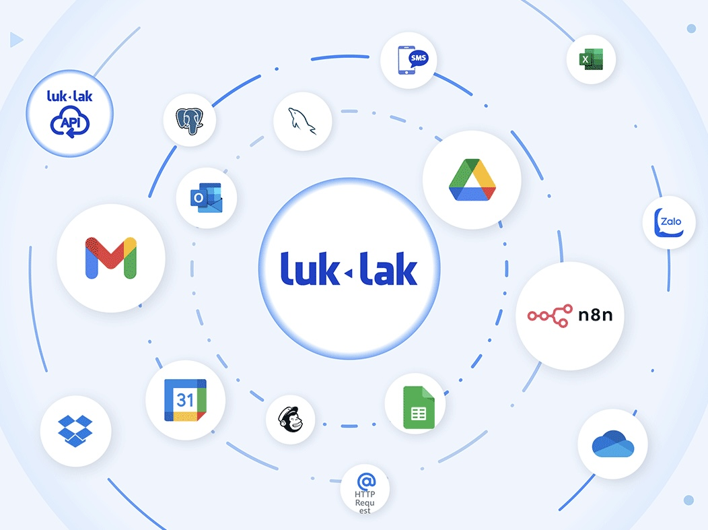
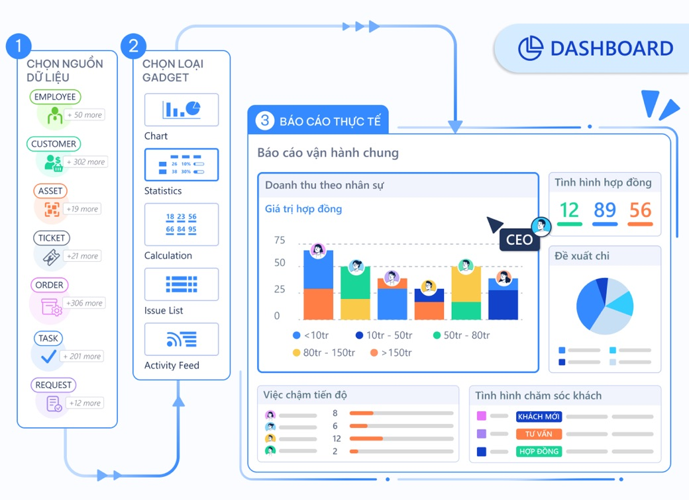

# Định vị Luklak & các phân khúc phần mềm doanh nghiệp


**tải về file pdf/ slide:** [**định vị luklak nocode & các phân khúc phần mềm doanh nghiệp**](https://drive.google.com/file/d/1V0bWIV50J1rT8O0qwPPqtBbRO8VLTQMD/view?usp=sharing)



LUKLAK Unified & Universal with Nocode & Lowcode


## Luklak & các phân khúc phần mềm doanh nghiệp

Thị trường phần mềm doanh nghiệp có thể được chia thành 4 phân khúc - cách tiếp cận như dưới đây.

<figure><figcaption></figcaption></figure>

### **1. Phần mềm đóng  gói**

* Ví dụ như Base, 1Office với các tính năng làm sẵn, đóng gói cố định, dùng chung cho hàng ngàn doanh nghiệp khác nhau.
* Nhanh, tiện, rẻ nhưng giới hạn bó cứng trong những tính năng có sẵn, không phát triển làm riêng được các tính năng theo nhu cầu đặc thù của từng doanh nghiệp.
* _Nếu các tính năng làm sẵn này đáp ứng được nhu cầu thì Luklak khuyến nghị doanh nghiệp nên dùng luôn vì nhanh tiện rẻ. Nếu cần làm các tính năng theo nhu cầu riêng thì Luklak là một lựa chọn tốt._

### **2. Luklak Nocode & Lowcode**

* Giải pháp mới, cách tiếp cận hoàn toàn mới về công nghệ quản lý vận hành doanh nghiệp
* Doanh nghiệp dành lại quyền làm chủ, dễ dàng kéo thả tự tạo các chức năng đa dạng theo nhu cầu vận hành hàng ngày.
* _Doanh nghiệp tự kéo thả tạo tính năng mà không mất thêm chi phí. Hoặc nếu không muốn tự làm thì dùng dịch vụ làm giải pháp của Luklak, với chi phí thấp bằng 10% so với thuê outsource làm phần mềm riêng._

### **3. Phần mềm làm riêng**&#x20;

* Làm riêng phần mềm cho mình với tính năng đặc thù theo nhu cầu, thường là thuê outsource. Những tính năng làm riêng này sẽ có ở lúc mới làm, còn sau khi đi vào vận hành về sau muốn tuỳ biến, tối ưu, phát triển tiếp thì cũng gặp rào cản khó khăn, mất nhiều thời gian và chi phí.
* Chi phí khá đắt đỏ, nhiều rủi ro do doanh nghiệp không nắm được kĩ thuật, không kiểm soát được chất lượng phần mềm, và khó duy trì phát triển về sau.
* _Luklak mang lại khả năng tự tạo tính năng theo nhu cầu, với thời gian & chi phí chỉ bằng 10% thuê outsource_

### **4. Giải pháp hãng  lớn**&#x20;

* Các giải pháp lớn của hãng hàng đầu thế giới như Oracle, SAP, Salesforce… thường dành cho những doanh nghiệp rất lớn, hệ thống quản trị vận hành phức tạp
* Chi phí đắt đỏ triệu đô bao gồm tiền mua bản quyền phần mềm và tiền dịch vụ tư vấn triển khai giải pháp
* _Luklak không cạnh tranh thay thế cho các giải pháp hãng lớn này, mà mang lại giải pháp vừa phải cho các doanh nghiệp vừa và nhỏ với tư duy và cách tiếp cận tương tự các giải pháp hãng lớn, với chi phí và thời gian triển khai chỉ bằng 10%._

### **So sánh các phân khúc giải pháp**

So sánh các khía đặc điểm & ưu nhược điểm của 4 phân khúc phần mềm doanh nghiệp

<figure><figcaption></figcaption></figure>

<figure><figcaption></figcaption></figure>

## Luklak Nocode kéo thả tự tạo tính năng

* Luklak cung cấp các miếng lego logic để người dùng có thể tự tay kéo thả, tự tạo tính năng, dùng ngay trong ngày, mà không cần biết code.
* Tạo nên thế hệ citizen developer, bất kì nhân sự bộ phận nào cũng có thể tự tạo tính năng nghiệp vụ vận hành cho bộ phận mình. Nhân sự được trao quyền, được tự chủ và hệ thống vận hành doanh nghiệp sẽ được tối ưu cải tiến liên tục theo tinh thần Kaizen.

<figure><figcaption></figcaption></figure>



<figure><figcaption></figcaption></figure>

* Mọi chức năng đều vận hành thông suốt trên một hệ thống hợp nhất & phổ quát, không phải chuyển qua lại giữa nhiều app khác nhau.
* Chat trao đổi trực tiếp trên mọi công việc chức năng, không còn phải chuyển qua app chat rời rạc.

<figure><figcaption></figcaption></figure>

## Khách hàng nói gì

 Người thật nói thật, click mở ra mà xem

## Các miếng lego nocode

> _**"we do all the hard work, so you don't have to"**_

Luklak đã đầu tư sâu rộng xử lý các vấn đề kĩ thuật phức tạp bên dưới để đóng gói tạo thành các miếng lego logic bên trên - là nền tảng cho hệ thống nocode & lowcode - cho phép người không  biết kĩ thuật cũng có thể dễ dàng kéo thả tự tạo các tính năng riêng theo nhu cầu.

### Universal Object

* Là đơn vị phổ quát để làm dữ liệu & tính năng bằng kéo thả, không phải làm kĩ thuật xuống sql database
* Mỗi loại đối tượng sẽ định nghĩa được workflow và data field, và mọi chức năng nghiệp vụ đều được tạo ra từ universal object này. dù đó là task trong task management, customer trong crm hay employee trong human resource management…
* Universal object là “đơn vị cốt lõi” của toàn hệ thống, vừa giúp tạo mọi chức năng mà không cần kĩ thuật, vừa giúp cho các tính năng như universal automation, unified dashboard có thể tương tác & tổng hợp mọi đối tượng, dữ liệu công việc.

<figure><figcaption></figcaption></figure>

### Universal Workflow

* Mọi đối tượng tính năng - nghiệp vụ được tạo ra từ Universal Object sẽ luôn có Universal Workflow bên trong, giúp chuẩn hoá luồng quy trình cho mọi tính năng công việc.
* Trực quan hoá luồng quy trình với các Trạng Thái (Status) và Bước Chuyển (Transition) với nhiều cài đặt về phân quyền, nhập liệu và tự động&#x20;

<figure><figcaption></figcaption></figure>



### Universal Automation

Universal Automation được coi là bộ não xử lý của hệ thống Luklak Nocode & Lowcode.&#x20;

* Vừa xử lý các thông tin logic của nghiệp vụ, vừa tự động hoá các tác vụ lặp đi lặp lại theo quy chuẩn
* Kết nối tương tác với mọi dữ liệu chức năng được tạo ra từ Universal Object tạo ra luồng thông suốt liên bộ phần phòng ban.

<figure><figcaption></figcaption></figure>

### External Integration

Luklak Universal Automation có khả năng kết nối tích hợp Luklak với các phần mềm bên ngoài:

* Gửi/ nhận webhook để tương tác trực tiếp với các phần mềm có khả năng nhận/ gửi webhook
* Thông qua ứng dụng trung gian như [n8n](https://n8n.io/), thông qua đó có kết nối tới rất nhiều phần mềm phổ biến trên thế giới.

<figure><figcaption></figcaption></figure>

### Unified Dashboard

* Dễ dàng kéo thả tự tạo các báo cáo theo nhu cầu riêng, không còn bị giam lỏng trong các báo cáo tạo sẵn
* Mọi dữ liệu chức năng được tạo ra trên Luklak đều là Universal Object, đi kèm với ngôn ngữ truy vấn Universal Query Lanuage (UQL) cho phép người dùng dễ dàng truy vấn và tổng hợp dữ liệu thông suốt liên bộ phận, tạo báo cáo hợp nhất mà không cần mất chi phí đầu tư thêm các hệ thống  Data Warehouse, ETL, Business Intelligence phức tạp tốn kém.

<figure><figcaption></figcaption></figure>

### Unified Livechat with Data

Lần đầu tiên trên thế giới có một hệ thống cho phép hợp nhất giao tiếp tương tác với mọi chức năng, dữ liệu được tạo ra:

* Live chat trao đổi trực tiếp trên mọi đầu việc, mọi điểm dữ liệu và nghiệp vụ được tạo ra từ Nocode & Lowcode. Không còn bị đứt gãy luồng công việc, không còn cảnh dữ liệu & công việc một nơi, chat trao đổi về công việc đó ở một nẻo app chat rời rạc nữa.
* Dữ liệu có cấu trúc (structure data) của chức năng công việc và dữ liệu phi cấu trúc (unstructure data) từ chat trao đổi tự do liền mạnh ở một nơi, không còn bị phân tán, mất mát, khó tìm.

<figure><figcaption></figcaption></figure>

### Unified Inbox

* Mọi thông tin cập nhật từ mọi chức năng - phòng ban đều tập trung về một nơi, nắm rõ mọi sự
* Không còn phải chuyển qua lại nhiều app chóng hết cả  để nắm tình hình

<figure><figcaption></figcaption></figure>

### Unified Application

* Có đủ đầy cả app hoạt động trên desktop và mobile
* Mọi chức năng nocode & lowcode tạo ra trên desktop ngay lập tức chạy được trên mobile app, không cần làm gì thêm.

<figure><figcaption></figcaption></figure>
