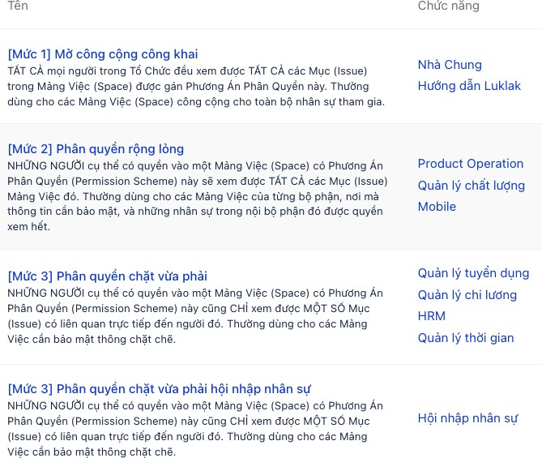

# Permission & Notification

### Vai trò (role)

* Định nghĩa các vai trò, cấp bậc khác nhau như thành viên, quản lý, quản trị
*   Vai trò (role) sẽ được dùng để định nghĩa phân quyền (permission) và thông báo (notification)

    thông báo (notification)
* Lựa chọn _phương án thông báo (notification scheme)_ phù hợp với tính chất chức năng công việc
* Cho phép tinh chỉnh sâu rộng ai được nhận được thông báo khi có hành động gì diễn ra

## Phân quyền (permission)

* Lựa chọn _phương án phân quyền (permission scheme)_ phù hợp với tính chất chức năng công việc
* Cho phép tinh chỉnh sâu rộng ai được phép làm gì

## Thông báo (notification)

* Lựa chọn _phương án thông báo (notification scheme)_ phù hợp với tính chất chức năng công việc
* Cho phép tinh chỉnh sâu rộng ai được nhận được thông báo khi có hành động gì diễn ra

## PERMISSION & PRIVILEGE

### tổng quan

.png>) về mặt kĩ thuật luklak là hệ thống nocode & lowcode cho phép doanh nghiệp tự tạo các chức năng công việc đa dạng & đặc thù theo nhu cầu riêng

.png>) về mặt ứng dụng, luklak là hệ thống quản trị vận hành sâu rộng, hợp nhất & phổ quát cho doanh nghiệp

do dó, khả năng phân quyền & bảo mật dữ liệu là yếu tố được luklak đầu tư cực kì sâu rộng và linh hoạt để đảm bảo khả năng vận hành tốt. ít có phần mềm phổ biến nào có mức độ phân quyền ở mức như luklak.

### Phạm vi & hành động có thể phân quyền

#### dữ liệu mục việc

đây là phần rộng nhất, phổ biến nhất cần phân quyền. cần hiểu cấu trúc cơ bản của nó là dạng:

.png>) dữ liệu công việc hàng ngày chính là các _**issue (mục việc)**_ nằm trong các _**space (mảng việc)**_. đến lượt nó thì tính năng của space lại được định nghĩa ở _**chức năng (function)**_.

đối tượng chức năng

**đối tượng có thể nhận phân quyền**

### permission scheme

### giới thiệu chung

.png>) _**permission scheme (phương án phân quyền)**_ là một bộ tổ hợp các định nghĩa tùy biến để phân quyền, trong đó định nghĩa rõ ràng đối tượng nào, có quyền thực hiện hành động gì.

.png>) ở trong admin hệ thống có sẵn 4 bộ _**permission scheme**_ với các mức độ chặt chẽ khác nhau có thể dùng cho các tính chất công việc khác nhau. và người dùng cũng có thể tự tạo được các bộ riêng tùy chỉnh theo nhu cầu.

.png>) khi tạo ra một _**chức năng (function)**_ thì sẽ cần chọn một phương án phân quyền đã được tạo ra trong admin.

### tùy chỉnh phân quyền

với mỗi _**permission scheme (phương án phân quyền)**_ thì người dùng có thể tùy chỉnh cực kì chi tiết, linh hoạt và sâu rộng xem ai được làm gì.

có 24 hành động có thể tùy chỉnh phân quyền cho 5 loại đối tượng khác nhau.

.jpeg>)

.jpeg>)

### cấu trúc tổ chức & đối tượng phân quyền

cấu trúc tổ chức công việc của một doanh nghiệp thường rất da dạng & sâu rộng, và việc phân quyền là nhiệm vụ vừa phức tạp và vừa quan trọng cốt yếu cần đảm bảo:

.png>) nhân sự được truy cập vừa đủ vào các thông tin cần cho công việc của người đó, và không được truy cập vào những chỗ không được phép.

.png>) tiết kiệm thời gian & dễ dàng trong các thao tác phân quyền khi nhân sự vào ra, thay đổi tính chất công việc…

để làm điều đó

.png>) việc phân quyền thủ công tới từng user/ nhân sự vào từng nơi một mỗi khi nhân sự vào ra là một điều cực kì kinh khủng, tốn thời gian và dễ sai sót.

.png>) do đó, các phần mềm nói chung sẽ sinh ra các đơn vị tổ chức trung gian, gom nhóm để thực hiện việc phân quyền. cách phổ biến nhất là tạo ra các group (nhóm người dùng) tương ứng với các tính chất công việc nào đó, phân quyền sẵn cho các group đó vào các khu vực công việc tương ứng. mỗi khi có nhân sự mới vào thì chỉ cần đưa vào đúng nhóm, là tự động được quyền truy cập mọi dữ liệu liên quan đã được cấp quyền cho các nhóm.

luklak cũng có group dùng để phân quyền, và hơn thế nữa, luklak còn đầu tư thêm nhiều đối tượng tổ chức khác nữa để người dùng có thể phân quyền và linh hoạt một cách rất sâu rộng. ít app nào bên ngoài sâu rộng ở mức như luklak trong việc phân quyền.

#### user group (nhóm người dùng)

là cách tổ chức phân quyền phổ biến nhất:

.png>) mỗi một vai trò, tính chất công việc nào đó đã định hình thì tạo ra một group tương ứng trong admin, trong group chứa các user có thể thêm vào.

.png>) các group đó được cài đặt sẵn để nhận được các quyền trong permission scheme (phương án phân quyền), area & space (khu vực & mảng việc), function (chức năng), filter (bộ lọc), dashboard (báo cáo), automation (tự động), folder (thư mục)

.png>) nhân sự mới vào hoặc thay đổi vị trí công việc thì chỉ việc thêm/ bớt vào các group tương ứng, là sẽ tự động được phân quyền.
