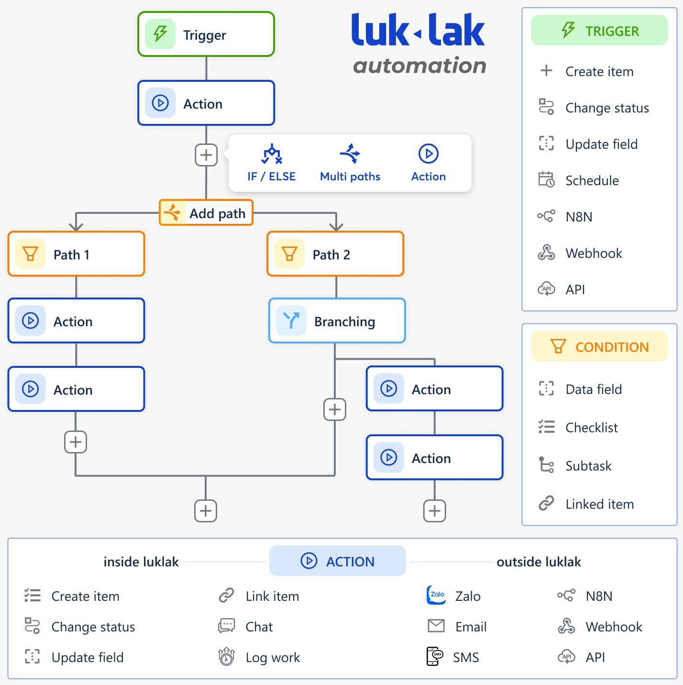

# Universal Automation

Automation là một đối tượng phổ quát (universal) trên toàn hệ thống, bất kì ở đâu, chức năng công việc nào cũng có thể dùng automation để tự động hóa các công việc lặp đi lặp lại, xử lý các logic công việc, thực hiện các hành động tự động. universal automation cũng cho phép kết nối dữ liệu, luồng công việc xuyên suốt ở mọi bộ phận làm việc, mọi chức năng trên app để có mức độ xử lý sâu rộng hơn, thông suốt hơn cho công việc. còn với các phần mềm thế hệ 2 như base, misa, 1office thì automation chỉ là một phần trong app workflow, nó có khả năng kết nối với dữ liệu ở chỗ khác nhưng ở mức rất hạn chế, chạy chậm và dễ xảy ra lỗi vì bản chất automation đó không phải thứ phổ quất toàn hệ thống, mà chỉ nằm trong workflow thôi.

.jpeg>)

**CLICK ẢNH ĐỂ PHÓNG TO XEM KĨ**

## Automation thế hệ 2

khác với phần mềm thế hệ 2 như zoho, base, misa, 1office, nơi mà

mỗi con chức năng công việc được tách rời thành một app riêng lẻ, dẫn tới mỗi công ty đó đều làm khoảng \~40 con app khác nhau, khá kinh dị cho người dùng

chỉ có 1 con app duy nhất trong \~40 con đó có tính năng workflow & automation (thường được gọi tên là quy trình, tiến trình)… là cài đặt được tự động hóa, còn \~39 con app chức năng công việc còn lại thì không thể

có một phạm vi nhỏ con app automation riêng lẻ kia tác động được tới các con app khác, nhưng nó cũng tương tự như khái niệm “tích hợpˮ. cơ bản ngay từ đầu khi sinh ra thì đó đã là các con app rời rạc riêng lẻ không liên quan đến nhau, nên sau đó mới phải cố gắng tìm cách “tích hợpˮ, kết nối lại. thì phần tích hợp kết nối đó cũng không được sâu rộng, thường chỉ thông được tầm **30%** dữ liệu & tính năng, và người dùng khi thực sự làm việc sâu thì vẫn phải chuyển qua lại làm việc trực tiếp trên từng app.

khi kết nối với một số app khác nhau thì mỗi app đó lại có tính năng, cấu hình dữ liệu cách làm riêng dẫn tới việc cài đặt phức tạp, mất nhiều thời gian tìm hiểu.

việc kết nối automation rời rạc này cũng thường hay bị sai lỗi, sót dữ liệu, chạy chậm

.jpeg>)

## luklak & universal automation

### **universal automation**

#### Automation thế hệ 3

**luklak unified & universal** là ứng dụng thế hệ 3, nên workflow của luklak là

**universal workflow** với các tính chất:

.png>) phổ quát và có sẵn trên toàn hệ thống, ở bất kì chức năng, ứng dụng nào được tạo ra

.png>) có khả năng tương tác và kết nối thông suốt với tất cả các ứng dụng, dữ liệu, đầu việc ở bất kì đâu

.png>) các chức năng khác nhau của luklak đều được tạo nên từ universal object duy nhất, nên cấu trúc dữ liệu cách làm là phổ quát giống nhau, có thể kết nối tương tác luôn được với nhau, chỉ cần tìm hiểu một lần là dùng dễ dàng cho mọi nơi.

## Nguyên lý hoạt động

automation cho phép

.png>) tự động hóa sâu rộng và linh hoạt các công việc, luồng, dữ liệu, logic cần xử lý .png>) kết nối tương tác với các hệ thống bên ngoài

.png>) tăng hiệu suất và chất lượng công việc;g iamr sự phụ thuộc vào cảm xúc và sai sót cá nhân

một automation rule (quy tắc tự động hóa) sẽ gồm 3 thành phần cài đặt chính:

.png>) **trigger (event & condition)**: định nghĩa điểm khởi để kích hoạt khởi chạy một quy tắc tự động hóa nào đó. ví dụ có thể dựa trên hành động một đầu việc dữ liệu mới được tạo ra, một công việc được chuyển trạng thái hoặc chuyển người

làm… có thêm bộ lọc dựa trên NQL để tinh lọc chỉ bắt các sự kiện đáp ứng được các điều kiện, tiêu chí nhất định.

.png>) **advanced logic**: cung cấp các logic xử lý đa dạng và linh hoạt theo các nhu cầu khác nhau, ví dụ như if/ else, multi paths, branching

.png>) **automated action**: là các hành động được tự động hóa, bao gồm cả các hành động trong nội bộ hệ thống luklak (như cập nhật trường, chuyển trạng thái, gửi tin nhắn chat…) cho đến các hành động kết nối với bên ngoài (gửi webhook, gửi email, zalo…)

#### ACTION

các hành động tự động thực hiện trong luklak:

.png>) create issue/ sub issue/ checklist .png>) change status

.png>) update field .png>) link issue

.png>) send chat message to space chat, issue chat, private chat các hành động kết nối với bên ngoài:

 gửi email

các hành động kết nối với bên ngoài đang được làm:

.png>) gửi tin nhắn zalo oa (đang làm) .png>) gửi sms tới số điện thoại

.png>) tích hợp với n8n để thực hiện hành động ở các app khác  gửi webhook/ api

#### IF/ ELSE & MULTIPATHS

&#x20;lulak automation cung cấp logic rẽ nhánh sâu rộng, linh hoạt

&#x20;if/esle: rẽ 2 nhánh hành động dựa trên kết quả đúng sai của 1 điều kiện lọc. cài đặt nhanh chóng.

&#x20;multi-paths: rẽ theo nhiều nhánh khác nhau, dựa trên nhiều điều kiện khác nhau.

#### BRANCHING

là tính năng khá đặc thù và sâu của luklak, ít ứng dụng nào có automation cho việc này.

automation rule thường sẽ chạy các hành động trên mục kích hoạt (trigger issue) đáp ứng trigger & condition. và branching cho phép rẽ nhánh thực hiện các hành động tự động có liên quan đến mục kích hoạt (trigger issue), bao gồm:

&#x20;các mục được lọc tùy ý theo nql  parent/ child issue

&#x20;tất các issue được tạo ra trong quá trình chạy một automation rule  issue mới nhất được tạo ra trong quá trình chạy

&#x20;các issue được kết nối FUNCTIONAL ACCOUNT

đây là tính năng rất mạnh và đặc biệt của luklak, rất hiếm ứng dụng làm

automation cho đầu tư sâu đến mức này. functional account là tài khoản chức năng (khác với tài khoản người dùng - user) chuyên dùng để chạy các automation rule, để đảm bảo đúng phân quyền:

&#x20;đủ quyền để truy cập đủ các dữ liệu và thực hiện các hành động cần thiết

&#x20;không cho vượt quyền xử lý dữ liệu ngoài phạm vi cho phép, dẫn tới các lỗ hổng về bảo mật dữ liệu.

các app khác mà automation không có automation account thì sẽ phải dùng 2 loại tài khoản cực hữu để chạy các automation rule:

&#x20;dùng tài khoản cá nhân của nhân sự (user): thì khó truy cập hết dữ liệu, và rule của người này tạo ra sẽ khó ứng dụng được cho người khác

&#x20;dùng tài khoản hệ thống (system account) thì tài khoản này thường có quyền truy cập dữ liệu toàn hệ thống. nếu cá nhân (user) bất kì được dùng tài khoản này thì có thể làm lộ hoặc xóa các dữ liệu mà bình thường họ không có quyền truy cập.

functional account của luklak sẽ hoạt động như sau:

admin sẽ tạo các functional account dành riêng cho các bộ phận, mảng việc. và sẽ cấp quyền cho phép những user nhất định được chọn và dùng tài account này cho automation.

admin cấp quyền truy cập dữ liệu cho các functional account này thông qua permission scheme như bình thường, để đảm bảo các tài khoản sử dụng sẽ không bao giờ vượt quá quyền truy cập được phép.
