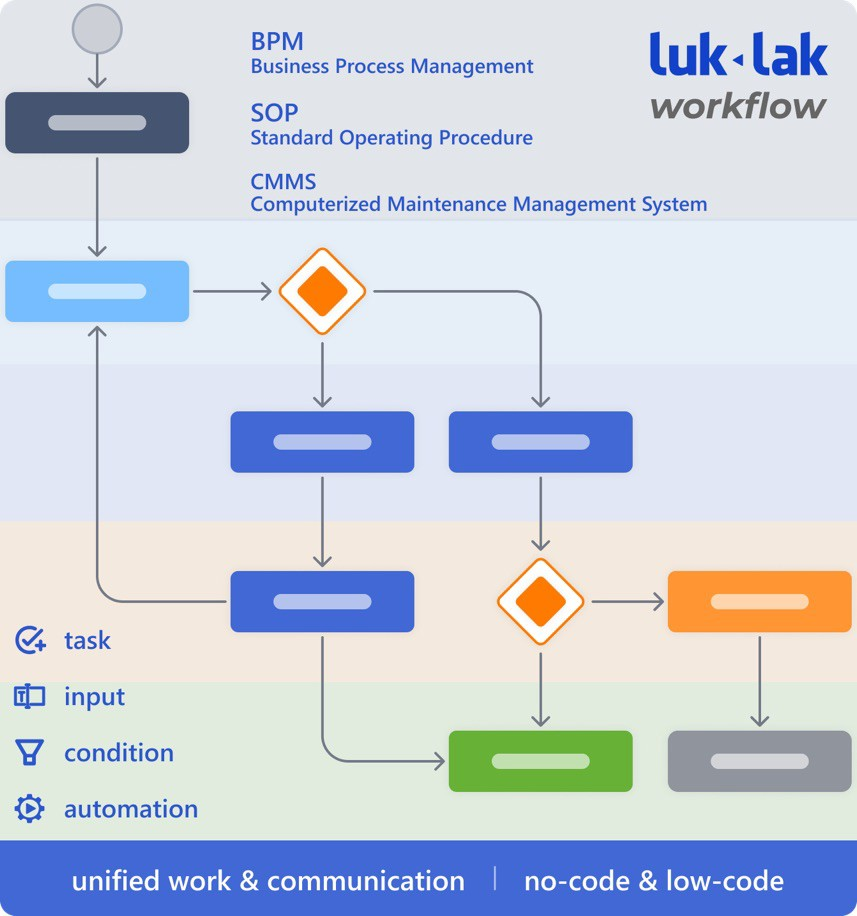
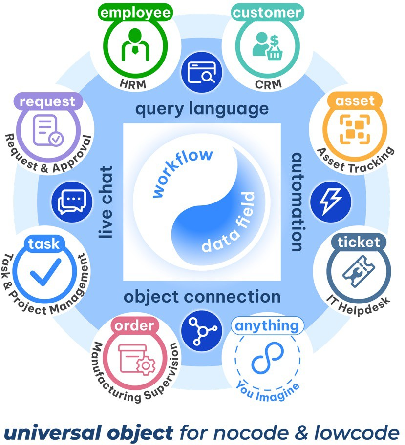

# Universal Workflow

WORKFLOW (UNIVERSAL)

kiểm soát công việc chạy đúng luồng quy trình nghiệp vụ đã được cấu hình trong function.

* Thể hiện tính universal workflow của lukak, mọi việc, mọi nơi đều có có workflow
* Hiện ngay chuyển trạng thái ở trên o chat, dễ thấy dễ dùng, làm tăng vọt tỉ lệ cập nhật workflow khi làm việc
* Đang làm việc gì đến bước nào, mở workflow guide ra có hướng dẫn quy trình làm việc ngay trên mục việc luôn, không phải mở quy trình in giấy hoặc ở file chỗ khác (như google docs) ra để xem.

## UNIVERSAL WORKFLOW

3 mức độ workflow & automation&#x20;

mức 1 - lonely status

mức 2 - isolated workflow app

mức 3 - universal workflow & automation luklak universal workflow

### 3 mức độ workflow & automation

.png>) nói “có tiền khôngˮ thì ai cũng đều có tiền cả, khác nhau chỉ là mức độ, có chục triệu và có chục tỉ vẫn đều là có tiền

.png>) nhiều app có workflow, nhưng đi sâu vào dùng thì mới biết là mức độ sâu rộng và sự mượt mà là khác nhau nhiều.

dưới đây là 3 mức độ về workflow, mà các app khác nhau có thể ở các mức khác nhau.

.jpeg>)

### mức 1: lonely status

.png>) phổ biến ở các app quản lý công việc (task management) như trello, clickup, base wework, 1office 1work, lark task

 chỉ có các status rời rạc và lạc lõng, không có sự gắn kết định nghĩa chặt chẽ luồng đi của việc

.png>) đa phần là không có khả năng cài đặt cấu hình, điều kiện chuyển giữa các trạng thái

nói chung là ở mức cơ bản, chỉ cập nhật được trạng thái công việc, ngoài ra thì thôi.

### mức 2: isolated workflow app

.png>) là các app riêng biệt để làm quy trình như kissflow, pipefy, base workflow, amis quy trình, 1office workflow, lark approval

 có khả năng định nghĩa trạng thái (status) và các luồng đi (transition) một cách chặt chẽ, trực quan. có khả năng cài đặt nhiều thứ như điều kiện, thẩm quyền, và tự động hóa.

.png>) mỗi công ty như zoho, base, misa, 1office (phần mềm thế hệ 2 làm tầm 40 con app/ module khác nhau, đại ý là mỗi chức năng công việc lại tách thành 1 con app rời. và workflow là 1 trong số 40 con đó và chỉ vào 1 app đó mới làm được workflow & automation. còn 39 app chức năng còn lại mà doanh nghiệp vẫn dùng cho nhiều mảng việc khác nhau thì không có khả năng định nghĩa workflow & automation. đơn giản nhất là các app quản lý công việc (task management) bên đó hoàn toàn không định nghĩa được workflow & automation, và các chức năng khác như crm, hrm… cũng không nốt.

nói chung tính năng workflow là khá hoàn chỉnh, chỉ tội là phải chui vào đúng app đó mới dùng được workflow, 90% công việc nằm ở 39 app còn lại thì chịu, không làm được quy trình gì cả.

### mức 3: universal workflow & automation

.png>) luklak unified & universal là ứng dụng thế hệ 3 có tính hợp nhất và phổ quát.

 xét riêng về tính năng workflow & automation thì luklak cũng đầy đủ như thế hệ 2, với khả năng định nghĩa status, transition, condition, automation rất mạnh

 thứ làm cho luklak workflow vượt trội đó là tính universal của workflow, nghĩa là bất kì chức năng công việc nào trên hệ thống thì đều có workflow & automation engine mặc định có sẵn trong đó. có thể cài đặt workflow & automation ở bất kì chức năng công việc nào như it helpdesk, task management, crm, hrm, request & approval…

quy trình là trái tim của hệ thống vận hành doanh nghiệp, và nó phải thực sâu rộng ăn sâu vào mọi ngõ ngách, mọi nơi công việc của doanh nghiệp. nghĩa là cần universal workflow có tính phổ quát.

### luklak universal workflow

### universal workflow

.png>) workflow của luklak mang tính universal là một phần cơ hữu vận hành trên toàn hệ thống, với mọi công việc của doanh nghiệp. không kiểu như các phần mềm feature software thế hệ 2 là app workflow rời riêng, chỉ vào đó mới làm được workflow, còn đa số các công việc khác làm ở app khác thì không

 workflow & automation của luklak có khả năng ứng dụng trực tiếp về quy trình và chuẩn hóa vận hành như BPM, SOP, CMMS

 cốt lõi nhất, universal workflow

 nó cũng là một trong số các **miếng lego nocode lõi** để từ đó doanh nghiệp có thể tự tay kéo đó tạo ra được ra dạng các chức năng công việc khác nhau.

### universal object

universal object của luklak chính là đối tượng phổ quát để làm tính năng với nocode & lowcode.

bên trong mỗi universal object có 2 nửa do người dùng có thể tự định nghĩa:  workflow

 data field

bên ngoài là các đối tượng có thể làm việc trực tiếp với universal object bao gồm:  universal query language: truy vấn và tổng hợp dữ liệu đối với mọi chức năng

được tạo ra từ universal object

&#x20;universal automation: tự động hóa các hành động, xử lý logic và kết nối mọi dữ liệu được tạo ra từ universal object

&#x20;object connection: tương tự như khái niệm “connecting the dotsˮ để tạo ra thứ mới, thì luklak cho phép người dùng tự định nghĩa các kết nối giữa universal object để tạo ra bức tranh lớn hơn, chức năng lớn hơn.

&#x20;live chat: mọi công việc, dữ liệu, chức năng tạo ra bởi universal object đều có khả năng live chat trao đổi trực tiếp trên đó, chứ không phải lôi sang chỗ khác để chat.

universal workflow là 1 trong những miếng lego nocode lõi của giúp người dùng tự tay kéo thả tạo ra các chức năng đa dạng đặc thù theo nhu cầu
