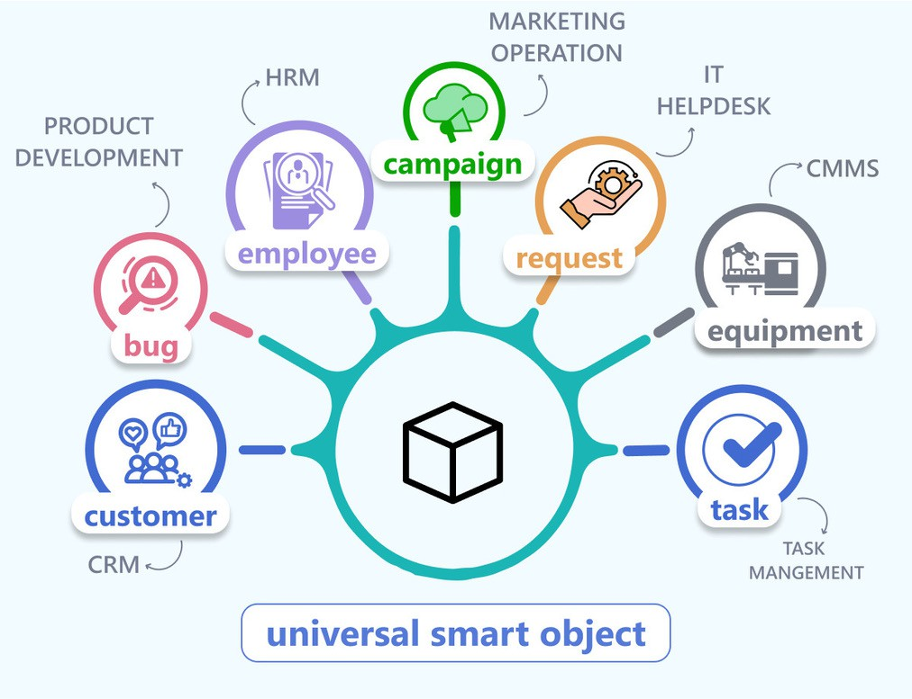
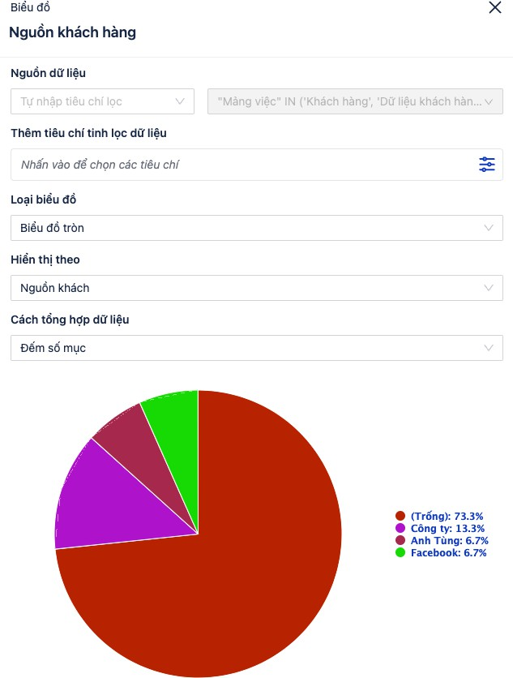

# Bộ lọc, Báo cáo & UQL

QUẢN LÝ & BÁO CÁO

### nội dung thêm bên ngoài:

tính năng quản lý của luklak [https://docs.google.com/document/d/1hRlF8TyPXZ5Ek8ZRO3Z1CYsN\_LmCnUoFa2zwZIc0VRg/edit#heading=h.b6cew0](https://docs.google.com/document/d/1hRlF8TyPXZ5Ek8ZRO3Z1CYsN_LmCnUoFa2zwZIc0VRg/edit#heading%3Dh.b6cew0eumag8)

luklak dashboard: [https://www.facebook.com/100000222907695/posts/pfbid0vB5rxmjRG9ohXaLegHkUTS5Ch7bPRumykunVud6ExJo7VP](https://www.facebook.com/100000222907695/posts/pfbid0vB5rxmjRG9ohXaLegHkUTS5Ch7bPRumykunVud6ExJo7VPo5pbsZYXLcoHRMm7DSl/?_rdc=1&_rdr)

[\_rdc=1&\_rdr](https://www.facebook.com/100000222907695/posts/pfbid0vB5rxmjRG9ohXaLegHkUTS5Ch7bPRumykunVud6ExJo7VPo5pbsZYXLcoHRMm7DSl/?_rdc=1&_rdr)

một hệ thống có tính năng tốt thì người dùng sẽ đưa nhiều việc, nhiều thông tin dữ liệu lên.

khi có quá nhiều thông tin dữ liệu, thì khả năng quản lý, nắm bắt, phân tích dữ liệu sẽ trở nên cực kì quan trọng, nếu không sẽ bị lụt trong thông tin.

### universal query language

bắt đầu bằng thứ sâu xa bên dưới, đó là khả năng truy vấn và tổng hợp dữ liệu - có cái này mạnh thì bên trên người dùng mới có được các tính năng tổng hợp, báo cáo mạnh

mọi chức năng, công việc trên luklak đều được tạo ra từ một đơn vị phổ quát (universal object), nên các dữ liệu công việc khác nhau (task trong task management, custom trong crm, employee trong hrm…) đều có thể dễ dàng kết nối, tổng hợp với nhau để làm báo cáo

luklak phát triển một ngôn ngữ truy vấn dữ liệu gọi là **NQL (Natural Query Language)** rất mạnh mẽ, tương tự như truy vấn SQL vào database, nhưng lại rất thân thiện, dễ dùng kể cả với những người không biết kĩ thuật.

### universal search

**quick search**: đang làm bất kì việc gì, ở đâu cũng có thể dùng thanh basic filter trên cùng để lọc ra các dữ liệu công việc theo tiêu chí mình muốn. quick filter có sẵn các tiêu chí phổ biến hay dùng nhất cho công việc.

.jpeg>)

**detail search**: click vào icon bên góc trên - phải sẽ mở ra bộ lọc chi tiết, ở đây sẽ có tất cả các trường thông tin dữ liệu công việc có trên hệ thống, và có các câu lệnh lọc cực kì chi tiết, sâu rộng.

.jpeg>)

**NQL (Natural Query Language)**: hộp chữ nền xám ở dưới cùng của hình trên chính là NQL, ngôn ngữ giúp người dùng có thể tự viết những câu lệnh truy vấn nâng cao - đây là mức cao nhất.

### Saved filter & notification

các câu lệnh tìm kiếm như ở trên có thể lưu lại để tạo thành saved filter, chia sẻ cho nhiều người cùng dùng, rất tiện

nhu cầu lọc dữ liệu theo một tiêu chí/ tính chất nhất định như vậy là rất phổ biến trong doanh nghiệp. các công việc tiêu chuẩn, các quy trình làm việc chuẩn hóa luôn cần việc lọc ra dữ liệu đáp ứng đúng tiêu chí theo quy chuẩn làm việc đó.

thêm khả năng rất hay là cài đặt filter notification, tự động định kì gửi thông báo tới những người liên quan về tình hình công việc được lọc ra.

một vài ví dụ ứng dụng về bộ lọc lưu sẵn và gửi thông báo:

_các nhân sự nghỉ ngày hôm nay, gửi thông báo lúc 8h00 tới bộ phận nhân sự & trưởng các bộ phận khác_

_các dữ liệu khách hàng mới về mà trong vòng 24h giờ nhân viên kinh doanh chưa xử lý, gửi thông báo lúc 9h00 tới quản lý kinh doanh_

_các đầu việc chưa xong và trong vòng 7 ngày gần đây không có cập nhật gì, gửi thông báo 9h sáng thứ 2 hàng tuần tới cho nhân viên làm trực tiếp và người quản lý._

.png>)

.png>)

### dashboard

luklak dashboard: [https://www.facebook.com/100000222907695/posts/pfbid0vB5rxmjRG9ohXaLegHkUTS5Ch7bPRumykunVud6ExJo7VPo5p](https://www.facebook.com/100000222907695/posts/pfbid0vB5rxmjRG9ohXaLegHkUTS5Ch7bPRumykunVud6ExJo7VPo5pbsZYXLcoHRMm7DSl/?_rdc=1&_rdr)

các dashboard tạo sẵn tổng hợp thông tin dữ liệu theo nhu cầu, và trình bày dưới dạng trực quan giúp cho quản lý nắm bắt công việc nhanh chóng, tiện lợi.

khả năng lọc & tổng hợp dữ liệu (filter & search) như ở phần trên chính là đầu vào nạp dữ liệu cho cho dashboard, và dashboard chỉ việc bổ sung các gadget để tinh chỉnh thêm dữ liệu và vẽ thành các biểu đồ trực quan (visualize)

luklak nocode & lowcode cho phép người dùng tự tay kéo thả tạo các báo cáo đa dạng và đặc thù theo nhu cầu của riêng mình.

mọi dữ liệu ở các chức năng khác nhau trên luklak đều dựa trên universal object, nên đều có thể tương tác kết nối & tổng hợp dữ liệu cùng nhau vào trong một báo cáo.

.png>)

.png>)

.jpeg>) 
