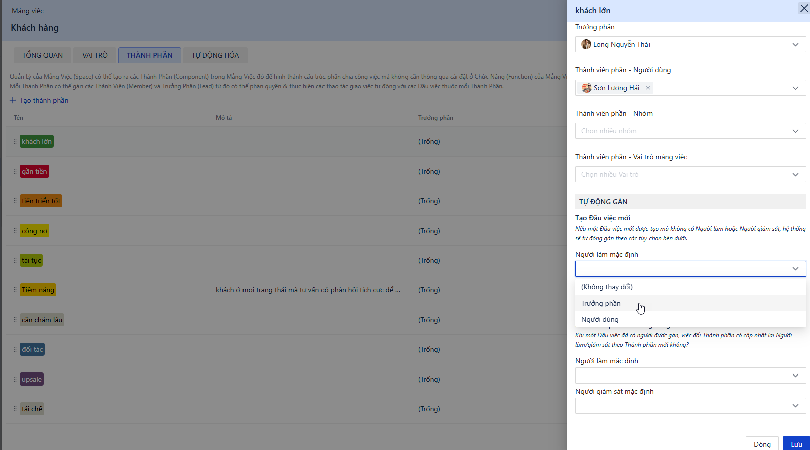

# Thành phần Mảng việc: Quản trị Sự thay đổi & Tự động Phân công

### Phân loại công việc linh hoạt & đa chiều


Trong vận hành thực tế, luồng công việc thường xuyên có sự biến động. Một dự án đang triển khai có thể phát sinh rủi ro, hoặc một khách hàng tiềm năng có thể thay đổi mức độ quan tâm theo thời gian. Thay vì phải thay đổi luồng trạng thái cố định hay tạo thêm các trường dữ liệu tĩnh, Thành phần giúp hệ thống tự động cập nhật người chịu trách nhiệm sát với tình hình thực tế, đảm bảo công việc luôn được xử lý đúng người, đúng thời điểm, đồng thời cung cấp các góc nhìn báo cáo đa chiều về hiệu suất đội ngũ.


### Thành phần vs. Trạng thái vs. Trường dữ liệu - dùng khi nào?

<figure><figcaption></figcaption></figure>


Để tối ưu hóa cấu trúc vận hành trên Luklak, người dùng cần phân biệt rõ vai trò của ba yếu tố sau:


* Trạng thái (Status): Chỉ sử dụng để ghi nhận tiến độ tuyến tính của công việc. Ví dụ: `MỚI` -> `ĐANG TƯ VẤN` -> `HOÀN THÀNH`. Không nên tạo các trạng thái mang tính phân loại tạm thời như `ĐANG TƯ VẤN - KHÁCH NÓNG` hay `ĐANG XỬ LÝ - RỦI RO CAO`.
* Trường tùy chỉnh (Custom Field): Sử dụng để lưu trữ thông tin tĩnh phục vụ phân loại (Ví dụ: Kênh nguồn = Facebook, Ngân sách = 50.000.000đ). Thay đổi giá trị trường dữ liệu thường không tự động làm thay đổi người trực tiếp xử lý công việc.
* Thành phần (Component): Đại diện cho trọng tâm công việc hiện tại và định danh đội ngũ trực tiếp phụ trách. Tính năng này được thiết kế chuyên biệt để xử lý các yếu tố thay đổi linh hoạt và phục vụ việc điều phối nhân sự.

<figure><figcaption></figcaption></figure>

### Định nghĩa & Ứng dụng

#### Trưởng phần, Thành viên phần

Sức mạnh thực sự của Thành phần nằm ở khả năng tự động hóa ủy quyền. Khi tạo một Thành phần, bạn đang thiết lập một cấu trúc nhân sự chuyên trách:

* **Trưởng phần (Component Lead)**: Một cá nhân duy nhất được chỉ định chịu trách nhiệm giám sát, dẫn dắt danh mục này.
* **Thành viên phần (Component Members)**: Một tập hợp các cá nhân, nhóm, hoặc vai trò trực tiếp thực thi công việc.

#### Ứng dụng

* **Tình huống 1: Quản trị rủi ro dự án**&#x20;

Một `🧊 Dự án` đang hoạt động bình thường ở trạng thái `ĐANG TRIỂN KHAI`. Khi phát sinh vấn đề nghiêm trọng, quản lý chuyển Thành phần từ `#Bình thường` sang `#Rủi ro cao`. Hệ thống tự động bổ nhiệm Giám đốc Dự án vào vị trí Người giám sát để trực tiếp chỉ đạo. Khi vấn đề được kiểm soát, Thành phần được chuyển về `#Bình thường` và đội ngũ tiếp tục vận hành theo luồng chuẩn.

* **Tình huống 2: Phân luồng mức độ tiềm năng** **của khách hàng**&#x20;

Một `🧊 Khách hàng` đang ở trạng thái `ĐANG TƯ VẤN` với Thành phần là `#Khách nóng` (giao cho nhóm Sales trực tiếp chốt đơn). Sang tuần sau, khách hàng cần thêm thời gian cân nhắc ngân sách, quản lý đổi Thành phần sang `#Khách lạnh` (luân chuyển cho nhóm Chăm sóc khách hàng nuôi dưỡng). Trạng thái tiến trình vẫn giữ nguyên là `ĐANG TƯ VẤN`, nhưng nhân sự cầm trịch đã được cập nhật chính xác.

* **Tình huống 3: Quản lý trọng tâm công việc** **theo chu kỳ (Sprint)**&#x20;

Với một danh sách hàng trăm `🧊 Yêu cầu` đang ở trạng thái `CHƯA BẮT ĐẦU`, quản lý kéo thả các yêu cầu quan trọng vào cột Thành phần `#Trọng tâm tuần này` trên báo cáo Kanban. Hệ thống sẽ tự động phân công công việc cho các thành viên trong đội ngũ trực chiến của tuần đó.

<figure><figcaption></figcaption></figure>

### Phân tích Chi tiết: Logic luân chuyển tự động hoạt động như thế nào?


Điểm cốt lõi của Thành phần là khả năng tự động hóa việc luân chuyển nhân sự. Hãy xem xét ví dụ cụ thể sau để hiểu rõ cơ chế đổi người làm của hệ thống:



Ví dụ bài toán: Một `🧊 Khách hàng` đang ở trạng thái `ĐANG TƯ VẤN` và được gắn Thành phần `#Khách lạnh`. Đội ngũ phụ trách hiện tại là Nhân viên Chăm sóc (đóng vai trò Người làm) và Trưởng nhóm CSKH (đóng vai trò Người giám sát).


| **Tên Thành phần** | **Trưởng phần (Tự động gán: Người giám sát)** | **Thành viên phần (Tự động gán: Người làm)** |
| ------------------ | --------------------------------------------- | -------------------------------------------- |
| `#Khách lạnh`      | Trưởng nhóm CSKH                              | Đội ngũ Nhân viên Chăm sóc                   |
| `#Khách nóng`      | Trưởng phòng Kinh doanh                       | Đội ngũ Nhân viên Sales                      |

Khi `🧊 Khách hàng` này tương tác tích cực và muốn nhận báo giá, quản lý thay đổi Thành phần sang `#Khách nóng`. Lúc này, hệ thống sẽ thực hiện 3 bước luân chuyển tự động:

1. **Chuyển giao quyền phụ trách**: Hệ thống tự động gỡ bỏ quyền phụ trách chính của nhóm CSKH. Đồng thời, dựa trên cấu hình của `#Khách nóng`, hệ thống tự động bổ nhiệm một Nhân viên Kinh doanh làm Người làm mới, và Trưởng phòng Kinh doanh làm Người giám sát mới.
2. **Bảo toàn ngữ cảnh công việc**: Nhân viên Chăm sóc và Trưởng nhóm CSKH cũ không bị loại bỏ hoàn toàn khỏi công việc. Hệ thống tự động lùi họ xuống danh sách "Người liên quan" (Followers). Điều này đảm bảo họ không bị mất quyền truy cập, vẫn có thể theo dõi tiến trình chốt hợp đồng để nắm bắt kết quả công việc mình từng tham gia, nhưng không còn áp lực chịu trách nhiệm chính.
3. **Tính kế thừa**: Nếu người dùng tạo thêm một `🧊︎ Báo giá` (việc con) bên trong `🧊 Khách hàng` này, nó sẽ tự động nhận giá trị Thành phần là `#Khách nóng`, đảm bảo toàn bộ cụm công việc được đồng bộ về cùng một đội ngũ xử lý.

### Trực quan hóa Kanban và Đo lường Báo cáo theo Thành phần


Thành phần không chỉ tự động hóa nhân sự mà còn mở ra các chiều không gian phân tích dữ liệu và quản trị trực quan mới:


<figure><figcaption></figcaption></figure>

* **Chế độ xem Kanban theo Thành phần**: Mặc định, bảng Kanban chia cột theo Trạng thái. Tuy nhiên, quản lý có thể bổ sung hoặc chuyển đổi chế độ xem Kanban thành các cột Thành phần (ví dụ: cột `#Trọng tâm tuần này`, cột `#Kế hoạch tuần sau`). Thao tác kéo thả một `🧊 Yêu cầu` từ cột này sang cột khác trên bảng Kanban sẽ ngay lập tức kích hoạt luồng tự động chuyển giao người phụ trách đã thiết lập ở trên.
* **Báo cáo và Phân tích nguồn lực**: Việc gán nhân sự theo Thành phần giúp quản lý dễ dàng tạo các khối Báo cáo (Dashboard) đo lường hiệu suất của từng nhóm chuyên trách. Bạn có thể nhanh chóng truy xuất dữ liệu xem nhóm `#Khách nóng` đang xử lý bao nhiêu khối lượng công việc so với nhóm `#Khách lạnh`, hoặc đo lường thời gian xử lý trung bình của từng Thành phần, từ đó đưa ra quyết định cân đối nguồn lực hợp lý mà không bị phụ thuộc vào các báo cáo Trạng thái thông thường.

### Hướng dẫn cấu hình

```
# Hướng dẫn Thiết lập Thành phần trong Mảng việc
Quy trình tạo Thành phần mới và thiết lập tính năng tự động luân chuyển người phụ trách.

## Section 1: Tạo Thành phần Mới
! Important: Người dùng cần có quyền Quản lý Mảng việc

1. Truy cập cài đặt Mảng việc
Di chuột vào tên `⏹️ Space` ở thanh menu bên trái, nhấn vào biểu tượng 3 chấm và chọn "Xem chi tiết".

2. Chuyển đến tab Thành phần
Điều hướng đến tab "Thành phần". Tab này nằm ở vị trí thứ 3, ở giữa tab "Loại việc" và tab "Gán vai trò".

3. Thêm Thành phần mới
Nhấn "Thêm Thành phần". Nhập tên Thành phần (ví dụ: `#Khách nóng`, `#Rủi ro cao`) và chọn một màu sắc đại diện để dễ dàng nhận diện.

## Section 2: Cấu hình Nhân sự & Tự động gán
* Tip: Thiết lập tự động gán ở bước này sẽ giúp tự động hóa việc phân công nhân sự, tiết kiệm thời gian điều phối thủ công mỗi khi có sự thay đổi trên bảng Kanban.

1. Chỉ định Trưởng phần và Thành viên phần
Chọn một nhân sự đảm nhiệm vai trò Trưởng phần, sau đó thêm các cá nhân, nhóm hoặc vai trò vào danh sách Thành viên phần.

2. Cài đặt vai trò tự động gán
Tại phần cấu hình tự động gán, thiết lập vai trò tương ứng: Chọn "Người giám sát" mặc định là Trưởng phần, và "Người làm" mặc định là Thành viên phần.

3. Thiết lập bảo toàn người liên quan
Cần đảm bảo **tích chọn** phần cấu hình giữ lại Người làm/Người giám sát cũ làm "Người liên quan" khi đổi Thành phần. Đây là thao tác cốt lõi để nhân sự cũ không bị mất quyền truy cập sau khi công việc được luân chuyển.

4. Cài đặt Nâng cao (Tùy chọn)
Tích chọn nếu tổ chức yêu cầu Thành phần là trường dữ liệu bắt buộc phải điền khi tạo việc mới, hoặc nếu muốn thiết lập một giá trị Thành phần mặc định.
```
