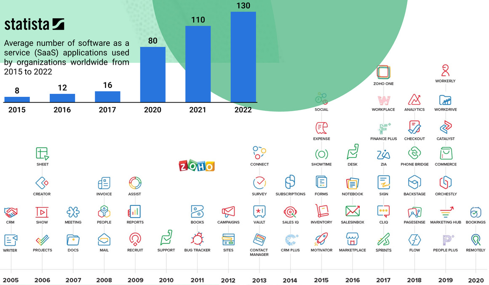

# Đồng bào Automation

## THỰC TRẠNG - Dòng chảy giá trị bị mắc kẹt




Doanh nghiệp của bạn vận hành dựa trên **các dòng chảy giá trị**: _Thấu hiểu khách hàng. Sự sáng tạo của đội ngũ. Quyết định thông minh dựa trên dữ liệu._&#x20;

Nhưng ngày nay, những giá trị đó đang bị mắc kẹt—đóng băng giữa các hệ thống riêng lẻ, "**ốc đảo**" không được xây dựng để giao tiếp với nhau.






<figure><figcaption></figcaption></figure>

> Vận hành rời rạc đồng nghĩa với:
>
> * Tốn **hàng giờ mỗi tuần/nhân sự** chỉ để chuyển qua lại các app, chuyển giao thông tin, đồng bộ công việc giữa các phòng ban.&#x20;
> * Việc một nơi, chat một nẻo. Nhóm chat ngập lụt. Mọi trao đổi dẫn đến quyết định quan trọng có thể biến mất khi nhân sự nghỉ việc, không dùng lại được
> * Insights quý giá về khách hàng, sản phẩm...không đến được đúng người, kịp thời
> * Không đánh giá được bức tranh vận hành tổng quan để cải thiện hiệu suất
> * Chậm trễ, tắc nghẽn nhất với những dự án liên phòng ban
> * Công việc chồng chéo, hiểu nhầm, lãng phí


**Giải pháp truyền thống**? Nếu có cố gắng tích hợp, xây cầu giữa những hệ thống đóng cứng rời rạc thì cũng chỉ chuyển được một vài phần thông tin (**khoảng 20%**), và khi có cập nhật gì là lỗi triền miên. Đó chính là "cái giá của sự chắp vá".




## GIẢI PHÁP - LUKLAK Universal Automation




Luklak **Universal Automation** (Tự động hóa phổ quát) là bộ não xử lý trung tâm giúp giải phóng giá trị, thông tin đang bị mắc kẹt và luân chuyển trơn tru **khắp toàn bộ tổ chức của bạn**, kết nối **con người, dữ liệu, quy trình và tin nhắn** một cách tự động.






Khác với các tự động hóa truyền thống chỉ hoạt động bên trong các công cụ cụ thể, Universal Automation của Luklak làm việc ở cấp độ toàn hệ thống, tạo ra dòng chảy không ma sát giữa:

* **Con người:** Đảm bảo mọi "đồng bào" nhân sự đều có đúng thông tin, đúng thời điểm.
* **Quy trình:** Chuyển giao công việc liền mạch giữa phòng ban, công đoạn mà không cần nhập liệu thủ công
* **Dữ liệu:** Chuyển đổi thông tin từ khâu này sang khâu khác mà không bị thất lạc
* **Tin nhắn:** Chat trao đổi trực tiếp trên từng Đầu Việc, giúp **mọi quyết** định đều có đúng bối cảnh & lưu trữ sử dụng lâu dài


Với LAIKA, **Universal Automation** tạo ra một **môi trường vận hành hợp nhất**, đảm bảo phối hợp vận hành trơn tru từ khi khách đăng kí tư vấn đến khi trở thành khách trung thành




## TRẢI NGHIỆM - Dòng chảy tự động hóa thông suốt \[ví dụ]




Hãy cùng xem **Universal Automation** hoạt động thực tế tại LAIKA, minh họa cách giá trị luân chuyển liền mạch trong toàn bộ hành trình của khách hàng Hoài An và qua tất cả các phòng ban, từ _Marketing, Kinh doanh, Thiết kế, Thi công/Triển khai, Quản lý Dự án & Kế toán, Chăm sóc Khách hàng_.







**Từ luồng vận hành thực tế đến giải pháp trên Luklak**: Mỗi luồng vận hành thường trải qua nhiều phòng ban, gồm nhiều bước. Luklak có khả năng giúp doanh nghiệp phối hợp làm việc trên mọi bước, quản lý dữ liệu, quy trình, điều kiện quy chuẩn & tự động hóa tối đa các tác vụ để nâng cao hiệu suất, trong 1 hệ thống hợp nhất.



Sơ đồ BPMN mô tả luồng vận hành liên phòng ban thực tế tại LAIKA, với các điểm nhấn màu cam là tác vụ tự động do hệ thống LUKLAK đảm nhiệm




## Từ Marketing Đến Hoàn Thành Dự Án: Vòng Đời Toàn Diện Của LAIKA – Nơi Giá Trị Chảy Tự Do


Universal Automation tạo ra dòng chảy giá trị không ma sát trên toàn bộ hoạt động của **LAIKA**. Dưới đây là một số tự động hóa liên phòng ban điển hình


### **Từ Marketing đến Kinh doanh**

* `Thông tin từ form khách điền` ngay lập tức trở thành `Đầu Việc Khách Hàng`.
* Tự động `ghi nhận nguồn mẫu quảng cáo` và phân công cho **Chuyên viên Tư vấn Kinh doanh** phù hợp dựa trên `chuyên môn và trọng số năng lực.`

### **Từ Kinh doanh đến Thiết kế**

* Insights khách hàng (sở thích, ngân sách, yêu cầu đặc biệt) thu thập trong quá trình tư vấn của **Chuyên viên Tư vấn Kinh doanh** chảy trực tiếp đến **Trưởng nhóm Thiết kế** và đội ngũ.
* Thay đổi trạng thái "Sẵn sàng" -> tự động kích hoạt việc tạo `Đầu Việc Thiết Kế` và các `Đầu Việc Phụ chuyên môn.`

### **Từ Kế toán đến Dự án:**

* Tiền về, kế toán xác nhận -> Tự động tạo `Đầu Việc Dự Án`&#x20;
* Các tác vụ được "may đo" cho **Quản lý Dự án** và các bộ phận liên quan với đầy đủ bối cảnh.

### **Từ Thiết kế đến Khách hàng:**

* Quy trình xem xét và phản hồi liền mạch trực tiếp trên `Đầu Việc Ý Tưởng Thiết Kế`.
* **Chuyên viên Tư vấn Kinh doanh** gửi `email tự động (với Giá Trị Thông Minh)` cho khách hàng với `link xem thiết kế` do **Trưởng nhóm Thiết kế** chuẩn bị.

### **Từ Hiện trường đến Thiết kế/Kinh doanh**

* **Nhân viên Khảo sát** quét mã QR trên di động để cập nhật các  thông tin khảo sát công trường kèm hình ảnh.
* Thông báo giới hạn công trường theo thời gian thực cho **Trưởng nhóm Thiết kế, Kinh doanh** để bám sát thực tế, tính đúng giá

### **Từ Dự án đến Chăm sóc Khách hàng**

* Khi dự án được **Quản lý Dự án** đánh dấu "Hoàn Thành" -> Tự động lên lịch `theo dõi, chăm sóc` cho **Chuyên viên Chăm sóc Khách hàng**.
* Theo dõi vấn đề với cảnh báo bộ lọc, giúp LAIKA **giải phóng sức lao động** khỏi việc theo dõi thủ công và có thể phát hiện vấn đề tận gốc



## NGUYÊN LÝ - Trigger + Condition + Action




Vậy dòng chảy không ma sát này thực sự hoạt động như thế nào? Nguyên lý hoạt động cực kì đơn giản: **Kích hoạt (Trigger), Điều kiện (Condition/Logic), Hành động (Action).**&#x20;

Từ những khối lego đơn giản & sâu sắc, **có vô vàn cách để kết hợp** giải quyết bài toán tự động hóa của doanh nghiệp






## BÍ MẬT PHỔ QUÁT - Universal Object&#x20;




Điều gì khiến mọi thứ luân chuyển **liền mạch** đến vậy? Phép màu nằm ở kiến trúc **Universal Object (Đối Tượng Phổ Quát), kết hợp với Universal Automation.**


## Tự động hóa phổ quát với Universal Object



## Báo cáo & nắm bắt thông tin hợp nhất





## **Cách Tiếp Cận Phổ Quát Của Luklak – Ngôn Ngữ Chung Của "Đồng Bào"**

Universal Automation có một cách tiếp cận khác biệt ngay từ bản chất:

* **Một mô hình đối tượng phổ quát (Universal Object Model)** - một nền tảng chung cho tất cả các đối tượng nghiệp vụ kinh doanh/vận hành. Mọi "đồng bào" Universal Object đều có chung cấu trúc lõi.
* **Một ngôn ngữ chung (One common language)** - mọi Universal Object có logic vận hành như nhau, có khả năng tương tác với Universal Automation ở cả Trigger, Condition, Action.
* **Khả năng hiểu tự nhiên (Native understanding)** - vì thiết kế có cấu trúc giống nhau, tất cả các phần của hệ thống tự nhiên "hiểu" nhau.


Đây không chỉ là sự tích hợp tốt hơn—đây là việc **loại bỏ hoàn toàn nhu cầu tích hợp trong nội bộ hệ thống**. Toàn bộ tổ chức của bạn nói một ngôn ngữ chung, nơi mọi thứ tự nhiên kết nối với mọi thứ khác. **Trong LUKLAK, mọi đối tượng đều nói cùng ngôn ngữ. Không cần phải "phiên dịch" giữa dữ liệu, công cụ, hay phòng ban.**


**Nguyên Tắc LEGO**


**Hệ thống vận hành cũ, đóng gói**: giống như những món đồ chơi chuyên dụng—một chiếc ô tô đồ chơi chỉ có thể là ô tô, một ngôi nhà đồ chơi chỉ có thể là nhà. Khi nhu cầu của bạn thay đổi, bạn phải mua đồ chơi mới.



**Hệ thống Hợp nhất & Phổ quát** mới: Mô hình **Universal Object** của Luklak hoạt động như LEGO—cùng những viên gạch cơ bản lắp ghép, tháo rời, lắp ghép thành cách hình thù khác nhau đáp ứng các nhu cầu vận hành **đặc thù** của doanh nghiệp mà không phải mua mới. Mọi viên gạch đều kết nối với mọi viên gạch khác thông qua những khớp nối đã được **chuẩn hóa.**




<strong>Object lên tiếng</strong>, Automation lắng nghe &#x26; suy nghĩ, rồi hành động tác động lên Objects.

### **Dòng Chảy Logic Phổ Quát – Sức Mạnh Từ Sự Đơn Giản**

Sức mạnh của kiến trúc này nằm ở một cấu trúc lõi phổ quát cho mọi nghiệp vụ trong doanh nghiệp:

1. **Điều gì đó xảy ra trên các Đầu Việc**: Một sự kiện xảy ra trên bất kỳ đầu việc nào trong hệ thống:
   * Trạng thái `Đầu Việc Khách Hàng` thay đổi thành "`THANH TOÁN ĐỢT 1`".
   * `Đầu việc Khảo sát` được tạo
   * Giá trị một trường dữ liệu trên bất kỳ đầu việc nào được cập nhật.

**-> Tự động hóa&#x20;**<mark style="color:blue;">**lắng nghe**</mark>: Hệ thống liên tục theo dõi các sự kiện này

2. **Tự động hóa&#x20;**<mark style="color:blue;">**suy nghĩ**</mark>**&#x20;thông qua các Điều kiện**: Hệ thống đánh giá các điều kiện dựa trên dữ liệu của đầu việc:

* "Đây có phải là dự án Dân dụng không?"
* "Các đầu việc con đã hoàn thành chưa"
* "Các phiếu thu đã thanh toán hết chưa"
* "Đâu là khách hàng của Hợp đồng này?"

3. **Tự động hóa thực hiện các&#x20;**<mark style="color:blue;">**Hành động**</mark>**&#x20;trên các Đầu Việc**: Dựa trên các điều kiện đó, hệ thống thực hiện hành động:

* Tạo các đầu việc liên quan mới.
* Cập nhật giá trị trường trên các bản ghi được kết nối.
* Kết nối đến các đầu việc khác
* Thông báo/gửi tin nhắn chat cho các thành viên đội ngũ phù hợp, vào các nơi phù hợp
* Kích hoạt các hệ thống bên ngoài.

## MAY ĐO dòng chảy vận hành




Các hệ thống truyền thống tạo ra silo, rồi chật vật kết nối chúng bằng các tích hợp mong manh và quy trình thủ công. LUKLAK loại bỏ hoàn toàn silo và tự động hóa dòng chảy giá trị từ đầu đến cuối. HÔM NAY, CHÚNG TÔI TUYÊN BỐ ĐỘC LẬP KHỎI HỆ THỐNG CŨ CHẬM CHẠP!






## Cuộc Cách Mạng Dòng Chảy Giá Trị


Hầu hết các doanh nghiệp **chấp nhận sự phân mảnh hệ thống như một điều không thể tránh khỏi**. Họ đầu tư rất nhiều vào các nền tảng tích hợp, các trình kết nối tùy chỉnh và "con người trung gian" để bắc cầu qua những khoảng trống giữa các công cụ chuyên dụng.


Cách tiếp cận này tạo ra:

* **Nợ kĩ thuật**: Mỗi kết nối đòi hỏi bảo trì liên tục.
* **Thất thoát thông tin quý giá**: Bối cảnh, thông tin biến mất trong quá trình chuyển giao qua các hệ thống
* **Khó mở rộng**: Độ phức tạp tăng theo cấp số nhân với các hệ thống mới.
* **Rào cản đổi mới**: Thay đổi đòi hỏi cấu hình lại nhiều tích hợp, làm chậm quá trình đổi mới, thích ứng với thị trường biến đổi nhanh chóng.


Universal Automation của Luklak có **một cách tiếp cận khác biệt ngay từ bản chất** bằng cách loại bỏ hoàn toàn nhu cầu tích hợp trong nội bộ. Thay vì kết nối các hệ thống riêng biệt, nó cung cấp một nền tảng hợp nhất nơi:


* **Thông tin chảy tự nhiên** mà không cần can thiệp thủ công – **Giải phóng dữ liệu & insights!**
* **Bối cảnh được bảo toàn tự động** khi công việc di chuyển giữa các đội ngũ.
* **Độ phức tạp được ẩn đi** dưới một giao diện trực quan, **tự tay kéo thả.**


**Khi và chỉ khi có hệ thống phổ quát, việc mở rộng quy mô mới rất dễ dàng mà không làm tăng độ phức tạp hệ thống, không tốn thêm chi phí, không cần bảo trì.** Hệ thống càng trở nên giá trị hơn khi xử lý nhiều dự án hơn, có nhiều dữ liệu quy về một mối hơn, tạo ra một **lợi thế cộng hưởng** mà các cách tiếp cận truyền thống, rời rạc không thể sánh được.




