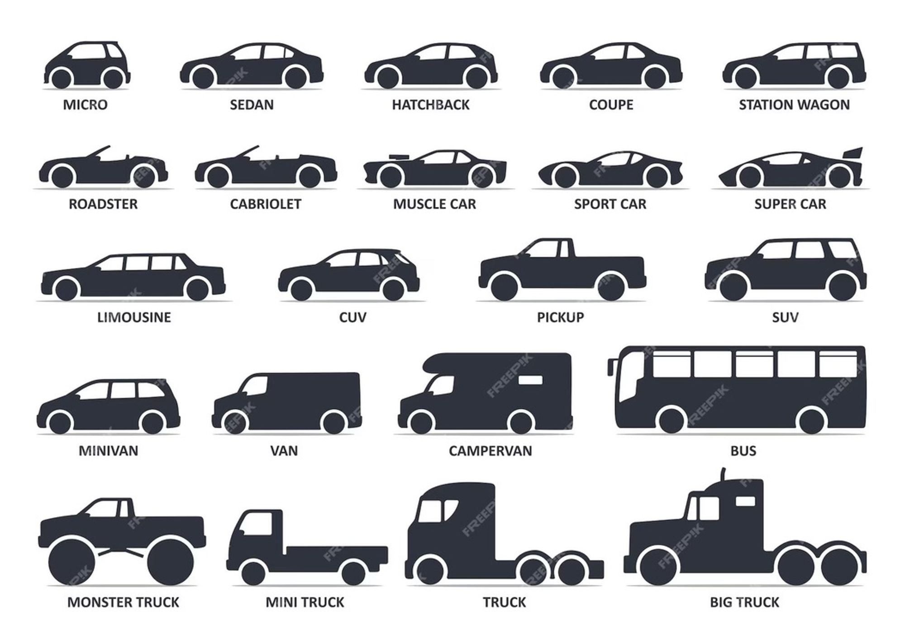
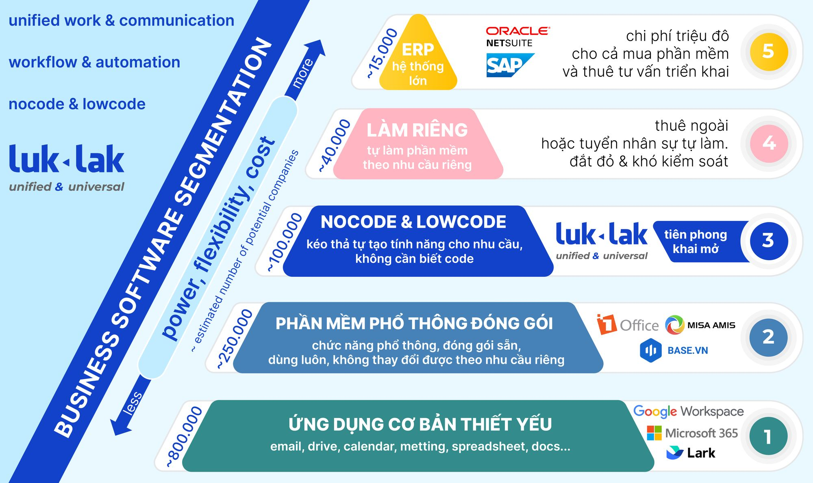

# Thế giới phần mềm doanh nghiệp

### Thế giới đa dạng & đa nguyên

Cũng tương tự như thế giới “ô tô”, dù chỉ nói một từ “ô tô” nhưng khi đi vào cụ thể thì nó chia ra làm rất nhiều loại, phân khúc khác nhau đáp ứng các nhu cầu ứng dụng đa dạng khác nhau:

<figure><figcaption></figcaption></figure>

* **Xe cá nhân:** loại xe này cũng lại được chia làm nhiều dòng xe khác nhau như sedan, suv, pickup… ; về số chỗ cũng đa dạng từ 4-5-7 chỗ; về thương hiệu và chất lượng từ bình dân phổ thông như toyota, huyndai, kia… cho đến hạng sang như bmw, mercdes cho đến siêu sang như rolls royce, bentley
* **Xe vận chuyển hành khách:** cũng phân làm nhiều loại khác nhau với số ngồi như 24, 35, 45 chỗ…
* **Xe tải chở hàng hóa:** cũng đa dạng như loại 500kg, 2,5 tấn, 5 tấn cho đến các xe siêu trường siêu trọng.

<figure><figcaption></figcaption></figure>

Tương tự với thế giới phần mềm doanh nghiệp, vô cùng đa dạng và phong phú, có rất nhiều kiểu nhu cầu khác nhau và nhiều loại sản phẩm khác nhau:

* **Không** có một sản phẩm nào có thể _“một tay che hết bầu trời”,_ một mình nó đáp ứng hết được tất cả các nhu cầu khác nhau.
* **Người dùng** cần hiểu rõ **nhu cầu** của mình, từ đó hiểu được nó nằm ở đâu trong bức tranh tổng thể để chọn được định hướng, tính chất, phân khúc phù hợp với nhu cầu; rồi mới đến **chọn sản phẩm,** nhà cung cấp cụ thể nào trong phân khúc đó để phù hợp với nhu cầu của mình.
* Nhìn chung, ngoài việc bên cung cấp sản phẩm cần có **chuyên môn** hiểu biết chuyên sâu thì **bên mua hàng**, lựa chọn sản phầm cũng cần có **hiểu biết sâu sắc** cụ thể về nhu cầu của mình, và hiểu biết ở mức độ nhất định về chuyên môn của mảng sản phẩm mình định mua… thì mới có thể phân tích, quyết định lựa chọn sản phẩm phù hợp, tránh lựa chọn sai lầm hoặc chi phí ẩn phát sinh về sau quá nhiều.

Phân khúc phần mềm doanh nghiệp được xếp theo hình kim tự tháp, với tính chất:

* Càng ở bên dưới thì số lượng càng nhiều; và giá trị, chi phí càng thấp
* Càng lên trên cao thì số lượng càng giảm; và giá trị, chi phí càng tăng

### Tầng 1 - ứng dụng cơ bản

<figure><figcaption></figcaption></figure>

* Giống như các ngành điện đường trường trạm trong nền kinh tế, thì đây là những ứng dụng cơ bản thiết yếu mà gần như bất kì dùng nghiệp nào đã dùng rồi
* Email, calendar, drive, spreadsheet, docs… là những **ứng dụng tính năng kĩ thuật nền tảng chung chứ không đi vào các tính năng cụ thể trong doanh nghiệp kiểu như task, crm, hrm…**
* chỉ là đang dùng bản miễn phí (phổ biến và thống trị là **microsoft 365** và **google workspace**), hay dùng bản miễn phí (gmail…)
* đây là lĩnh vực của các đại gia công nghệ thế giới, vì
  * nhìn tính năng bề mặt thì đơn giản nhưng kì thực hạ tầng kĩ thuật công nghệ bên dưới là rất sâu rộng mới làm được cho nó **chạy mượt,** và
  * quan trọng là đây là những tính năng mà nhiều phải cùng dùng, cùng tương tác, chia sẻ với nhau… nên phải có một tập người dùng đủ lớn trên phạm vi toàn thế giới.

### Tầng 2 - phần mềm phổ thông đóng gói

<figure><figcaption></figcaption></figure>

* Những chức năng cơ bản phổ thông trong doanh nghiệp kiểu như quản lý công việc, nhân sự, bán hàng, kế toán, quy trình…
* Phổ biến trên thế giới là kiểu zoho, và ở việt nam thì có các con tương tự zoho như base, misa, 1office
* Bán đại trà cho nhiều doanh nghiệp khác nhau dùng chung, nên chi phí tương đối rẻ, triển khai nhanh
* Tính năng đóng gói cố định, và mọi doanh nghiệp khác nhau đều dùng chung một kiểu tính năng. nên sẽ chỉ đáp ứng được khoảng 30-40% nhu cầu chung cơ bản các doanh nghiệp dùng chung; còn 60-70 các nhu cầu đa dạng, đặc thù riêng của từng doanh nghiệp thì khó làm được.
* Không cho phép tự tạo các tính năng riêng theo nhu cầu riêng của doanh nghiệp. **nếu doanh nghiệp muốn tính năng đặc thù theo nhu cầu thì phải chuyến sang khúc 4, tự làm phần mềm riêng (custom software)**

### Tầng 4 - tự làm phần mềm riêng (custom software)

_Khúc 3 nocode & lowcode là khúc hoàn toàn mới, luklak mới khai phá ở việt nam, nên sẽ trình bày sau cuối. chỗ này vẫn chuyển sang nói về khúc 4 - tự làm phần mềm (custom software), vì đó là lựa chọn phổ biến có sẵn trên thị trường._

<figure><figcaption></figcaption></figure>

Có 2 cách làm:

* Outsource: thuê công ty công nghệ bên ngoài làm
* Inhouse: tự tuyển đội nhân sự công nghệ nội bộ, tự quản lý toàn bộ nhân sự & quá trình phát triển tính năng, hạ tầng, bảo mật, bảo trì…

Việc tự làm phần mềm riêng luôn là một lựa chọn cực kì tốn kém, đắt đỏ và nhiều rủi ro… ngay cả với các công ty công nghệ, chứ đừng nói đến công ty không chuyên môn về công nghệ:

* Chi phí lần đầu thường mất vài trăm triệu đến nhiểu tỉ, và sau còn phát sinh thêm trong quá trình sử dụng lâu dài
* Thời gian thường mất vài tháng đến cả năm. thường trong 6 tháng đầu chỉ ra được thứ cơ bản, và trong quá trình sử dụng luôn phát sinh vấn đề và vừa làm vừa sửa. để đến một phần mềm hoàn chỉnh chạy trơn tru chắc mất vài năm
* Khó công ty không có chuyên môn sâu về công nghệ thì sẽ rất khó nắm bắt được hệ thống được tạo ra, chất lượng tốt hay không. và vấn đề rất nguy hiểm, rủi ro cao mà ít cty nhận thức trước đó là các vấn đề hệ thống, bảo mật, và khả năng bảo trì & phát triển tiếp về sau.

## Tầng 5 - hệ thống lớn

<figure><figcaption></figcaption></figure>

Các hệ thống lớn hàng đầu thế giới như SAP, Oracle Netsuite, Microsoft Dynamics…

* Chi phí rất cao, mua phần mềm cũng cả triệu đô và cũng không tự dùng được mà phải kí thêm hợp đồng tư vấn triển khai vài trăm triệu đến nhiều tỉ
* Thường phù hợp với các doanh nghiệp quy mô lớn, và quan trọng là có tư quy, hệ thống quản trị vận hành thực tế phải tương đối tốt rồi. nếu hệ thống vẫn đang non yếu mà đưa mấy cái này vào là sập luôn.

## Tầng 3 - luklak nocode & lowcode

<figure><figcaption></figcaption></figure>

Luklak tiên phong khai mở khúc 3, tạo ra không gian mới ở giữa khúc 2 & 4 hiện tại, với cách tiếp cận hoàn toàn mới mang lại trải nghiệm và giá trị vượt trội cho doanh nghiệp. kết hợp được cả ưu điểm và hạn chế nhược điểm của cả khúc 2 và khúc 4.

**luklak nocode & lowcode** mang lại sức mạnh & sự linh hoạt vượt trội.

### Tự tạo tính năng

Mỗi doanh nghiệp đều có vô số những nhu cầu đặc thù đa dạng mà phần mềm phổ thông đóng gói (khúc 2) không làm được. với luklak nocode & lowcode thì doanh nghiệp có thể tự tay kéo thả, tự tạo ra các chức năng công việc theo nhu cầu mình muốn mà không cần biết kĩ thuật, không phải trông chờ phụ thuộc vào các công ty làm phần mềm.

<figure><figcaption></figcaption></figure>

[bài nocode facebook (notion.site)](https://www.notion.so/b-i-nocode-facebook-2a081d3233d744fb93a1534e7c688760?pvs=21)

NoCode là một khái niệm đổi mới trong ngành công nghệ, cho phép bạn tạo ra ứng dụng hoặc phần mềm mà không cần phải viết một dòng mã lập trình nào. Tưởng tượng nó như là việc xây dựng mô hình LEGO: bạn có tất cả các khối cần thiết, chỉ việc lắp ghép chúng lại với nhau để tạo ra sản phẩm cuối cùng.

🌈 **Tự Do Sáng Tạo Với NoCode** Với sản phẩm phần mềm NoCode của chúng tôi, bạn không chỉ là người sử dụng công nghệ, mà còn là người sáng tạo nó. Không còn giới hạn bởi các tính năng đóng gói sẵn, bạn có thể:

* 🛠️ **Tự Tạo Tính Năng:** Chỉ với vài cú nhấp chuột, bạn có thể tạo ra các tính năng độc đáo phù hợp với nhu cầu cụ thể của mình.
* ⏱️ **Tiết Kiệm Thời Gian:** Không cần chờ đợi cập nhật từ nhà phát triển, bạn có thể nhanh chóng thực hiện ý tưởng của mình.
* 💡 **Dễ Dàng Sử Dụng:** Giao diện trực quan, thân thiện với người dùng, giúp bạn dễ dàng thao tác mà không cần kiến thức về lập trình.

**Ưu việt vượt trội của Luklak Nocode:**

Bên cạnh việc kéo thả tự tạo chức năng dễ dàng, Luklak Nocode có sẵn những tính năng vượt trội có sẵn:

* Live chat trao đổi trực tiếp tức thời trên từng đầu việc, từng điểm dữ liệu, ở mọi tính năng bạn tạo ra
* Workflow mạnh mẽ giúp thiết lập quy trình làm việc trực quan, chặt chẽ để chuẩn hóa & tự động hóa vận hành
* Hệ thống hợp nhất mọi chức năng công việc, dữ liệu ở một nơi, một màn hình duy nhất giúp luồng công việc thông suốt, không phải chuyển qua lại giữa các phần mềm khác nhau

### Mẫu chức năng tạo sẵn

Với nocode & lowcode, luklak đã kéo thả tạo sẵn các mẫu chức năng như dưới đây, khách có thể dùng được luôn mà không cần làm gì. và chính các doanh nghiệp cũng có thể kéo thả tự tạo các chức năng tương tự như này, theo nhu cầu riêng của mình.
