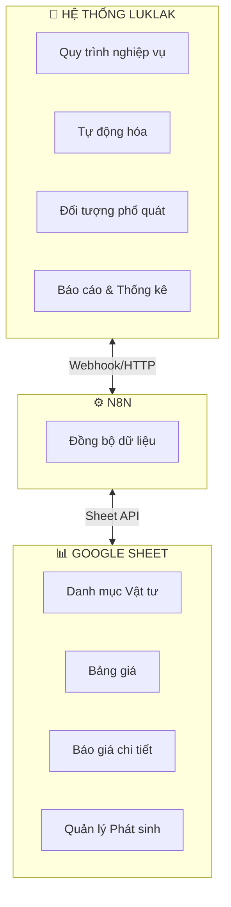

# Luklak Demo Hub (drafting)



### heading 2

#### heading 3

````mermaid

```mermaid

flowchart TB

    subgraph LUKLAK["🔄 HỆ THỐNG LUKLAK"]

        WF[Quy trình nghiệp vụ]

        AUTO[Tự động hóa]

        OBJ[Đối tượng phổ quát]

        DASH[Báo cáo & Thống kê]

    end

  

    subgraph SHEET["📊 GOOGLE SHEET"]

        DS[Danh mục Vật tư]

        GIA[Bảng giá]

        BG[Báo giá chi tiết]

        PS[Quản lý Phát sinh]

    end

  

    subgraph N8N["⚙️ N8N"]

        SYNC[Đồng bộ dữ liệu]

    end

  

    LUKLAK <-->|Webhook/HTTP| N8N

    N8N <-->|Sheet API| SHEET

```
````
















