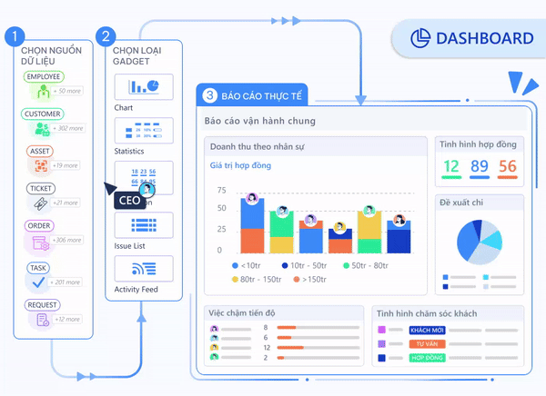

# Luklak Nocode & Lowcode 101

**Giới thiệu chung**


:crown:**Bước ngoặt vận hành**: Nội dung dưới đây sẽ giải thích vì sao lựa chọn Luklak là quyết định chiến lược đúng đắn của chủ doanh nghiệp giúp nâng cao nhanh chóng cả chất lượng & tốc độ vận hành, với chi phí hợp lý.



**tải về file pdf/ slide:** [**định vị luklak nocode & các phân khúc phần mềm doanh nghiệp**](https://drive.google.com/file/d/1V0bWIV50J1rT8O0qwPPqtBbRO8VLTQMD/view?usp=sharing)




### Tự tạo chức năng



<figure><figcaption>
Tự tay kéo thả những miếng lego sâu sắc &#x26; tự nhiên, tự tạo chức năng vận hành riêng theo ý mình
</figcaption></figure>

## Với luklak, doanh nghiệp <mark style="color:green;">giành lại quyền làm chủ vận hành</mark>

Trong thế giới của <mark style="color:blue;">luklak nocode & lowcode</mark>, doanh nghiệp không còn phải chạy theo phần mềm, mà là ngược lại, giành lại quyền làm chủ.&#x20;

Không còn phải cam chịu những phần mềm đóng gói cứng nhắc, tính năng thiếu thiếu thừa thừa, do người khác tạo, mà được tự tay kéo thả những miếng <mark style="color:blue;">lego nocode & lowcode sâu sắc & tự nhiên</mark> tự tạo ra chính xác những chức năng <mark style="color:blue;">riêng theo ý mình</mark>.

<figure><figcaption>
Ai cũng có thể sáng tạo ra chức năng vận hành theo ý muốn, dù là nhân viên hay quản lý
</figcaption></figure>

***

#### Tưởng tượng ra được là làm được

<figure><figcaption>
Mọi chức năng từ trong văn phòng &#x26; ngoài thực địa
</figcaption></figure>



<figure><figcaption></figcaption></figure>

## Phần mềm phổ thông đóng gói: <mark style="color:orange;">Rời rạc & bó cứng</mark>

_Các bất cập nội tại của phần mềm phổ thông, làm sẵn tính năng:_

(1) **Đóng gói, bó cứng**: Không bao giờ có thể đáp ứng nhu cầu đặc thù của từng doanh nghiệp. Bởi lẽ, đây là dạng phần mềm được làm ra 1 lần cho hàng nghìn doanh nghiệp dùng chung. Bạn có thể thấy chúng dễ bắt đầu để sử dụng nhưng chỉ sau 3-6 tháng là thấy kịch chân tường, muốn phát triển theo mong muốn cũng không được.

(2) **Rời rạc, phân tán**: Mỗi chức năng lại nằm trong một app riêng khiến trong một phiên làm việc, người dùng chuyển quá nhiều app. Cho dù chúng có được làm ra bởi cùng 1 công ty nhưng bản chất là rời rạc. Muốn liên kết chúng với nhau thì phải thông qua tích hợp API mà cũng chỉ có giới hạn. Hơn nữa, bạn không bao giờ có được dữ liệu công việc toàn vẹn ở một nơi.

<figure><figcaption>
<em>Ví dụ: Zoho với hơn 50 apps riêng lẻ (tăng theo thời gian), phục vụ các chức năng khác nhau. Cách duy nhất để giải quyết khi phát sinh nhu cầu là thêm 1 app mới.</em>
</figcaption></figure>



### Hợp nhất vận hành

<figure><figcaption>
Tất cả những chức năng tạo ra đều được hợp nhất một nơi
</figcaption></figure>


:crown: <mark style="color:blue;">**Thông suốt ở mức độ cao nhất:**</mark> Các chức năng tạo ra <mark style="color:orange;">không rời rạc, riêng rẽ</mark> như các app đóng gói phổ thông mà được hợp nhất một nơi trong hệ thống <mark style="color:green;">liền mạch từ giao diện & logic.</mark>

\
[Đọc thêm: Luklak Hợp nhất & Phổ Quát - không phải là cộng cơ học.](https://luklak.com/vi/#convergenceluklak)


## :green\_circle:Thực tế sử dụng (toàn công ty)


<mark style="color:blue;">**Chỉ có ở Luklak**</mark><mark style="color:blue;">:</mark> Lần đầu tiên, mọi công việc, dữ liệu, live chat, quy trình, tự động hóa và báo cáo - hợp nhất một nơi. Mọi phòng ban phối hợp mượt mà.




### Mọi phòng ban - một tổ chức

> * [x] Thiết kế cấu trúc tổ chức công việc chặt chẽ
> * [x] Mọi phòng ban làm việc trong 1 hệ thống duy nhất

<figure><figcaption>
<strong>Toàn cảnh</strong>: Doanh nghiệp quản lý &#x26; vận hành mọi phòng ban &#x26; nghiệp vụ với Luklak.  Toàn doanh nghiệp có cấu trúc tổng quan, với các <strong>khu vực</strong> công việc lớn và các <strong>mảng việc</strong> nhỏ hơn bên trong.
</figcaption></figure>

### Mỗi phòng ban có khu vực riêng

> * [x] Mỗi phòng ban linh hoạt tự thiết kế các chức năng làm việc riêng
> * [x] UI/UX liền mạch, thông suốt với mọi loại nghiệp vụ

<figure><figcaption>
Cấu trúc công việc thành các <strong>khu vực lớn</strong> với các <strong>mảng công việc nhỏ</strong> bên trong.  Ví dụ: Mảng việc <strong>Kinh doanh HN,</strong> nằm trong <strong>khu vực Kinh doanh.</strong>
</figcaption></figure>

### Giao việc & chat trực tiếp trên đầu việc

> Mỗi nghiệp vụ đều có:
>
> * [x] Bộ trường dữ liệu được thiết kế riêng (Custom fields)
> * [x] Mục kiểm (Checklist)
> * [x] Việc con (Subtask)
> * [x] Việc liên quan (Issue link)
> * [x] Chat hợp nhất (Chat on Issue)
> * [x] Trạng thái - Quy trình (Status - Workflow)

<figure><figcaption>
Ví dụ: 1 request tuyển dụng được tạo ra từ Luklak Nocode và  là giao diện nhân sự tương tác làm việc.  
</figcaption></figure>



### Việc nào cũng có quy trình chuẩn hóa

> * [x] Làm được BPM, SOP, CMMS

<figure><figcaption>
Kéo thả thiết kế quy trình trực quan cho mọi loại công việc. Vận hành chặt chẽ, không lủng thủng.
</figcaption></figure>

### Triển khai - thực thi dễ dàng

> * [x] Chuyển trạng thái công việc theo quy trình
> * [x] Hướng dẫn ở từng bước

<figure><figcaption>
Nhân sự dễ dàng chuyển trạng thái công việc theo quy trình được thiết kế sẵn
</figcaption></figure>

### Kanban view trực quan

> * [x] Nhân sự dễ bàn giao ở từng bước
> * [x] Quản lý có cái nhìn tổng quan

<figure><figcaption>
Kéo thả chuyển bước nhanh chóng. Kanban view cũng được tự thiết kế theo mong muốn
</figcaption></figure>



### Tự động hóa mọi ngõ ngách công việc

> Tự động tạo việc, chuyển trạng thái, cập nhật biến đổi dữ liệu, liên kế công việc, kết nối với bên ngoài\
> Tất cả đều do doanh nghiệp kéo thả thiết kế, mỗi quy tắc chỉ làm trong vài phút, tiết kiệm hàng nghìn giờ

<figure><figcaption></figcaption></figure>

### Tự động hóa thông suốt toàn hệ thống

<figure><figcaption></figcaption></figure>



### Đánh giá tình hình rộng, sâu, theo nhu cầu

<figure><figcaption></figcaption></figure>

### Làm việc trực tiếp trên báo cáo



### Hộp tin hợp nhất

> Nắm bắt mọi diễn biến công việc

<figure><figcaption></figcaption></figure>

### Cảnh báo kịp thời

> Thiết kế hệ thống thông báo, cảnh báo cho bất cứ loại công việc nào, theo điều kiện mong muốn.

<figure><figcaption></figcaption></figure>



## 7 bước tạo chức năng (+ví dụ)


:bulb:**Chức năng là gì?** Là đơn vị tổ chức của Luklak nocode, có thể hiểu là tấm bản đồ thiết kế logic vận hành của một mảng công việc lớn. \
\
Sau đó, mảng công việc được gắn với chức năng nào thì sẽ vận hành đúng theo chỉ dẫn của chức năng.


Giả sử bạn muốn tạo chức năng CRM để quản lý sâu sát mọi nghiệp vụ từ khách hàng đến hợp đồng, từ tư vấn đến chốt thành công. Chỉ với 7 bước đơn giản là làm được.

### B1 - Xác định chức năng & nghiệp vụ



#### Xác định các nghiệp vụ cụ thể

<figure><figcaption>
Một chức năng sẽ bao gồm các nghiệp vụ cụ thể bên trong. Ví dụ, với CRM, doanh nghiệp cần quản lý Khách hàng, lịch hẹn, deal, contact, triển khai, khiếu nại...
</figcaption></figure>

#### Thêm mới nghiệp vụ vào chức năng

<figure><figcaption>
Thêm mới Nghiệp vụ (Issue Type - Universal Object) nhanh chóng. Định nghĩa được nghiệp vụ cha và nghiệp vụ con.
</figcaption></figure>

***


:bulb:<mark style="color:blue;">**Universal Object - Miếng lego lõi quan trọng nhất:**</mark>

Đứng đằng sau mọi nghiệp vụ người dùng tạo ra đều là Universal Object - đơn vị lõi phổ quát & linh hoạt. Universal Object có thể đại diện cho bất cứ nghiệp vụ nào:

* **Customer** trong CRM
* **Employee** trong HRM
* **Task** trong task management
* **Request/ ticket** trong IT Helpdesk, Customer Service
* **Machine/ equipment** trong CMMS (Computerized Maintenance Management System

Đối tượng này được thiết kế phổ quát, đáp ứng mọi nhu cầu vận hành đa dạng, đặc thù.




#### Mảng việc chứa đầy đủ nghiệp vụ đã tạo

<figure><figcaption>
Ví dụ, mảng việc Kinh doanh HN đang chạy theo chức năng CRM.
</figcaption></figure>

<figure><figcaption>
 Mảng việc có các nghiệp vụ tương ứng đã được thiết kế ở chức năng,   như Khách hàng, triển khai, lịch hẹn...
</figcaption></figure>


Mỗi nghiệp vụ đều có hiển thị là 1 issue, nhưng có các trường dữ liệu & quy trình khác nhau, được định nghĩa ở bước 2 và bước 3


<figure><figcaption>
Ví dụ hiển thị thực tế của nghiệp vụ Customer (Khách hàng)
</figcaption></figure>



### B2 - Chuẩn hóa quy trình


:bulb:**Quy trình (Workflow) là gì?**&#x20;

\
Quy trình bao gồm các trạng thái (status) và bước chuyển (transition) giữa chúng, cho phép định nghĩa luồng đi chuẩn hóa cho mỗi nghiệp vụ.




> Thiết kế Quy trình trong luklak bao gồm:\
> \
> 1\. Thiết kế lưu đồ các bước thực hiện\
> 2\. Thiết lập điều kiện & quyền hạn thao tác ở các bước\
> 3\. Quy tắc tự động hóa tương ứng khi trạng thái thay đổi

#### Kéo thả tạo lưu đồ workflow trực quan

<figure><figcaption>
Ví dụ lưu đồ quy trình mà nghiệp vụ Customer sẽ chạy qua
</figcaption></figure>

#### Cấu hình điều kiện chặt chẽ

> Người được chuyển trạng thái

<figure><figcaption>
Ai là người được chuyển bước nào trong quy trình
</figcaption></figure>

> Trường dữ liệu của nghiệp vụ

<figure><figcaption>
Các trường dữ liệu đã điền đủ chưa
</figcaption></figure>

> Mục kiểm thuộc nghiệp vụ

<figure><figcaption>
Đầu việc liên quan đã hoàn thành theo tiêu chuẩn chưa
</figcaption></figure>



<figure><figcaption>
Ví dụ: Nhân viên kinh doanh chuyển Customer sang trạng thái Thất bại, bị cảnh báo do chưa điền Lí do thất bại theo cấu hình điều kiện đã thiết lập
</figcaption></figure>

<figure><figcaption>
Nhân sự làm đến đâu, có hướng dẫn trực tiếp ở bước đó
</figcaption></figure>



### B3 - Tạo trường dữ liệu tùy chỉnh



#### Kéo thả tạo trường dữ liệu cho nghiệp vụ

> * [x] Có thể thiết lập các điều kiện bắt buộc, validate dữ liệu

<figure><figcaption>
Ví dụ: định nghĩa trường dữ liệu đi kèm với nghiệp vụ Customer
</figcaption></figure>

#### Đa dạng các loại trường dữ liệu

<figure><figcaption>
Cung cấp đa dạng các kiểu dữ liệu, đáp ứng nhiều nhu cầu nghiệp vụ.
</figcaption></figure>


:crown:**Trường công thức (fx):** Cho phép tự động tính toán theo công thức +, -, \*, / và điều kiện IF/THEN, ELSE...mạnh mẽ.




#### Trường dữ liệu hiện lên như đã thiết lập

<figure><figcaption>
Thực tế làm việc: Nghiệp vụ Customer luôn kèm sẵn bộ dữ liệu đã tạo. Khi chuyển trạng thái, hệ thống tự động pop-up yêu cầu cập nhật trường, giúp nhân sự điền đủ thông tin. Không cần nhớ phải điền những gì.
</figcaption></figure>



### B4 - Thiết lập tự động hóa



#### Thiết lập quy tắc tự động hóa

> Chỉ cần xác định Trigger (Hành động kích hoạt), Flow logic (Điều kiến tự động hóa) và Action (Hành động) mong muốn.

<figure><figcaption>
Kéo thả để tạo ra các quy tắc tự động hóa
</figcaption></figure>

> Cho phép tự động hóa đa dạng tác vụ, từ  giao việc, tạo đầu việc con, tạo bộ dữ liệu chuẩn, chuyển trạng thái công việc, gửi chat, sms, email,...đến tương tác với bên ngoài qua API & webhook.

<figure><figcaption></figcaption></figure>

#### Mẫu các quy tắc tự động hóa

<figure><figcaption></figcaption></figure>



#### Tự động tạo Customer khi có khách điền form trên web

<figure><figcaption>
Tự động tạo Customer trong mảng việc của Kinh doanh, chạy chức năng CRM.
</figcaption></figure>

#### Tự động tạo lịch Google Calendar

<figure><figcaption>
Khi chuyển trạng thái khách hàng sang chốt lịch demo thì đặt lịch google calendar và mời email khách vào.
</figcaption></figure>

#### Tự động chia lead theo trọng số năng lực

<figure><figcaption>
Tự động chia lead cho nhân viên kinh doanh theo vòng tròn, và theo trọng số năng lực. Giúp tối ưu vận hành kinh doanh, đảm bảo khách được xử lý tốt nhất trong khả năng của mỗi người.
</figcaption></figure>

#### Tự động retarget thông qua Webhook

<figure><figcaption>
Khi Customer chuyển sang trạng thái "Tiềm năng", tự động bắn thông tin khách sang Facebook thông qua Webhook. Từ đây, bạn có thể tạo các campaign retarget khách hàng.
</figcaption></figure>

#### Tự động tạo phiếu thu khi ấn nút

<figure><figcaption>
Khi Kế toán cần tạo phiếu thu  -> Chủ động ấn nút Tạo phiếu thu là được. Hoàn toàn tự cấu hình được mọi nút theo nhu cầu.
</figcaption></figure>

#### Tự động cập nhật thông tin từ hệ thống ngoài

<figure><figcaption>
Khi hàng tồn kho không đủ, tự động cập nhật tình trạng vào khách hàng tương ứng trong Luklak. 
</figcaption></figure>



### B5 - Kết nối & tích hợp



#### Kết nối thông qua tự động hóa

> Luklak cho phép kết nối với các hệ thống ngoài, chỉ cần tạo action và chọn loại kết nối mong muốn: Zalo, Email, SMS, n8n, API, Webhook.

<figure><figcaption>
Luklak đã có tích hợp sẵn với các ứng dụng phổ biến như google drive, microsoft drive + calendar, google sheet, excel, email, zalo, dùng được luôn.
</figcaption></figure>

#### n8n - mở ra con đường kết nối sâu rộng

<figure><figcaption>
Luklak tích hợp sẵn với n8n, bên trung gian kết nối với hơn 400 ứng dụng phổ biến khác.
</figcaption></figure>



#### Tự động gửi email

<figure><figcaption>
Khi nghiệp vụ Khách hàng được chuyển sang trạng thái "Đã demo", tự động gửi email cảm ơn &#x26; tổng kết.
</figcaption></figure>

#### Tự động gửi tin nhắn Zalo

<figure><figcaption>
Khi hợp đồng đã ký thành công, gửi tin nhắn Zalo thông báo.
</figcaption></figure>



### B6 - Tự tạo báo cáo



#### Chọn nguồn dữ liệu, cấu hình báo cáo

<figure><figcaption>
Dashboard cho phép lấy dữ liệu từ bộ lọc, linh hoạt tự tạo các báo cáo trực quan, đa chiều, tiện dụng, không hề bó cứng.
</figcaption></figure>

#### Lựa chọn loại biểu đồ (gadget) đa dạng

<figure><figcaption>
Các loại gadget bao gồm: Biểu đồ, Bộ đếm, Thông kê, Tính toán, Danh sách &#x26; Dòng cập nhật
</figcaption></figure>

#### Bộ lọc linh hoạt, sâu rộng toàn hệ thống

<figure><figcaption>
Luklak filter không chỉ cho phép lọc dữ liệu trong mảng việc kinh doanh, mà là từ mọi điểm dữ liệu trên hệ thống ra để trả lời mọi câu hỏi về tình hình công việc
</figcaption></figure>

#### Không cần ETL phức tạp

<figure><figcaption>
Luklak Universal Query Language (UQL)
</figcaption></figure>



#### Báo cáo kinh doanh real-time

> * [x] Làm việc trực tiếp được trên báo cáo
> * [x] Cấu hình linh hoạt theo nhu cầu phân tích



### B7 - Cấu hình phân quyền & thông báo



#### Cấu hình phương án phân quyền

> 25 sự kiện phân quyền chi tiết

<figure><figcaption></figcaption></figure>

#### Cấu hình phương án thông báo

> 13 sự kiện thông báo chi tiết

<figure><figcaption>
Ví dụ, Sales Manager đang thiết lập phương án thông báo, cho phép ai thuộc <strong>Vai trò Nhân viên kinh doanh</strong> đều nhận được thông báo khi có hành động <strong>chuyển trạng thái</strong>
</figcaption></figure>



#### Người dùng nhận được thông báo như đã thiết lập

<figure><figcaption>
Ví dụ: Người dùng thuộc vai trò Nhân viên kinh doanh nhận được thông báo khi chuyển trạng thái Hợp đồng sang Tiền về
</figcaption></figure>



## Tính hợp nhất & phổ quát


:crown:**Chuyển đổi toàn diện**: Luklak không chỉ là một công cụ quản lý công việc & giao tiếp đơn thuần, mà là một hệ thống với cách tiếp cận <mark style="color:blue;">**hợp nhất & phổ quát (unified & universal)**</mark> hoàn toàn mới giúp CEOs nâng cao hiệu suất quản trị & vận hành.




#### Hợp nhất mọi chức năng (Unified System)

> **Trước Luklak:**
>
> :x: Dùng 30-50 apps rời rạc (từ UI, tính năng, dữ liệu)
>
> :x: Cùng 1 nhân sự, phải trả nhiều phí user khác nhau
>
> **Với Luklak:**
>
> * [x] Mọi chức năng, một hệ thống vận hành. Không còn phải chuyển app chóng mặt
> * [x] Mỗi user chỉ cần trả tiền cho 1 slot, dùng được mọi chức năng&#x20;

#### Hợp nhất công việc & chat (Unified Work & Communication)

<figure><figcaption></figcaption></figure>

> **Trước Luklak:**
>
> :x: Việc nằm rải rác ở các ứng dụng Task, CRM, HRM,...Khi trao đổi thì phải mang ra chỗ khác để chat
>
> :x: App chat chỉ thuần chat,  không quản lý được công việc
>
> **Với Luklak:**
>
> * [x] Chat hợp nhất trên từng đầu việc.&#x20;
> * [x] Chat kênh theo cấu trúc phòng ban, và luôn đi kèm với công việc

#### Hợp nhất dữ liệu (Unifed Data)

<figure><figcaption></figcaption></figure>

> Trước Luklak:
>
> :x: Mỗi app một database riêng rời, không nói ngôn ngữ chung
>
> :x: Dữ liệu chat tách rời khỏi dữ liệu công việc
>
> Với Luklak:
>
> * [x] Tất cả chức năng đều được tạo ra từ Universal Object
> * [x] Báo cáo thông suốt dữ liệu mọi chức năng, nghiệp vụ
> * [x] Dữ liệu chat (phi cấu trúc) gắn chặt với dữ liệu công việc (có cấu trúc)

#### Hợp nhất mọi cập nhật (Unified Inbox)

<figure><figcaption></figcaption></figure>

> Trước Luklak:
>
> :x: Thông báo từ khắp các app, hỗn loạn và vẫn bị miss
>
> Với Luklak:
>
> * [x] Mọi cập nhật, diễn biến, trao đổi về mọi công việc đều được đổ về 1 hộp tin
> * [x] Các tab phân loại thông tin giúp nắm bắt đúng việc & nhanh chóng



#### Đơn vị lõi phổ quát (Universal Object)

> **Trước Luklak:**
>
> :x: Mỗi app một database hard-code sẵn, dùng chung cho hàng nghìn doanh nghiệp
>
> :x: Người dùng không được tự điều chỉnh, chỉ nhà phát triển/developers mới làm được
>
> **Với Luklak:**
>
> * [x] Người dùng tự định nghĩa dữ liệu, nghiệp vụ cho chức năng công việc
> * [x] Người dùng tự thêm, bớt, định nghĩa dữ liệu phản ánh chính xác nghiệp vụ theo cách họ muốn vận hành

<figure><figcaption>
Universal Object - đơn vị lõi phổ quát, trái tim của mọi chức năng được tạo ra với luklak nocode
</figcaption></figure>

#### Việc nào cũng chuẩn hóa (Universal Workflow)

> **Trước Luklak:**
>
> :x: Quy trình là 1 app rời riêng, phải vào app đó mới làm được quy trình
>
> :x: Công việc ở các app khác thì không có quy trình
>
> **Với Luklak:**
>
> * [x] Quy trình hợp nhất trong cùng một hệ thống với công việc & chat
> * [x] Việc nào cũng có quy trình chuẩn hóa

#### Tự động hóa thông suốt (Universal Automation)

<figure><figcaption></figcaption></figure>

> **Trước Luklak:**
>
> :x: Automation trong từng app cục bộ, nhỏ lẻ
>
> :x: Muốn có automation liên phòng ban, cần 1 app kết nối trung gian hoặc tự tích hợp, dễ lỗi.
>
> **Với Luklak:**
>
> * [x] Automation "sống" trên toàn hệ thống
> * [x] Cho phép kết nối dữ liệu, xử lý logic, tự động hóa tác vụ thông suốt mọi việc & phòng ban

#### Ngôn ngữ truy vấn phổ quát (Universal Query Language)

<figure><figcaption></figcaption></figure>

> **Trước Luklak:**
>
> :x: Lọc cục bộ ở từng app, app có gì dùng nấy
>
> :x: Không thể lọc tìm về tình hình công việc tổng thể vì mỗi việc một nơi. Nếu muốn, cần làm ETL phức tạp
>
> **Với Luklak:**
>
> * [x] Truy vấn & tổng hợp mọi điểm dữ liệu từ universal object trên toàn hệ thống.
> * [x] Tự nhiên, thân thiện, không cần biết SQL. Không cần làm ETL phức tạp.



## Mở rộng & cải tiến

Hệ thống nocode linh hoạt như lego: dễ lắp ráp, tháo gỡ và mở rộng. Không cần mua phần mềm mới. Thích ứng nhanh với nhu cầu thay đổi, đảm bảo vận hành liên tục và hiệu quả.

