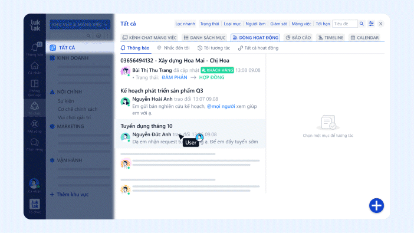

# Luklak vỡ lòng (Starter pack for CEOs)

## Hệ thống Luklak

<figure><figcaption></figcaption></figure>


**Giao diện & logic hợp nhất**: Người dùng chỉ cần tìm hiểu giao diện & logic hệ thống một lần, sẽ có thể tự xây dựng mọi chức năng vận hành.&#x20;


### Giao diện



<figure><figcaption>
1 giao diện hợp nhất để vận hành nhiều chức năng.
</figcaption></figure>

<figure><figcaption></figcaption></figure>




<figure><figcaption>
Phần lớn công việc hằng ngày diễn ra trong mảng việc, nơi mọi thành viên trong tổ chức làm việc, trao đổi, giám sát.
</figcaption></figure>

What can happen inside a Space?

Take a peek (thực tế làm việc)



Các thành phần chính cấu thành giao diện

<mark style="color:blue;">Main menu</mark>

* Phòng làm việc:&#x20;
* Cá nhân:&#x20;
* Thông báo:
* Chat riêng:
* Mở rộng:

<mark style="color:blue;">Structure column</mark>

<mark style="color:blue;">Content Area</mark>

<mark style="color:blue;">Issue Detail</mark>

<mark style="color:blue;">Issue Types</mark>

<mark style="color:blue;">Filter</mark>

<mark style="color:blue;">Quick Action</mark>

Hoạt động diễn ra hằng ngày trong mảng việc

### Logic hệ thống


**Tự tin thiết kế chức năng**: Các miếng lego của hệ thống Luklak Nocode vừa độc lập, vừa có liên quan chặt chẽ. Hiểu mối liên kết giữa chúng, người dùng có thể tự tin thiết kế mọi chức năng.


#### Tổ chức - Khu vực - Mảng việc - Chức năng

<figure><figcaption></figcaption></figure>

#### Mảng việc - Các đối tượng bên trong

<figure><figcaption></figcaption></figure>

<figure><figcaption>
Ví dụ các Mục việc tiêu chuẩn &#x26; Mục việc con trực thuộc mảng việc Sales &#x26; CRM
</figcaption></figure>


**Dữ liệu công việc - Cập nhật - Chat trao đổi hợp nhất**: Mảng việc là nơi nhân sự trực tiếp làm việc, trao đổi, tương tác & nắm bắt cập nhật. Lần đầu tiên, dữ liệu về đầu việc & chat trao đổi về công việc đó được hợp nhất một nơi, trong cấu trúc mảng việc.


#### Chức năng - Mảng việc - Người dùng


**Mảng việc được sinh ra từ chức năng**: Chức năng quyết định Mảng việc sẽ có những _nghiệp vụ, thông tin dữ liệu, quy trình làm việc, tự động hóa, và báo cáo gì, phân quyền & thông báo_ như thế nào.


#### Chức năng - Các miếng lego

<figure><figcaption>
Sơ đồ mối liên hệ logic giữa các miếng lego.
</figcaption></figure>

Giải thích

* **Các Thành Phần của một Chức Năng:**
  * Sơ đồ cho thấy cách một **chức năng** được xây dựng từ nhiều yếu tố cốt lõi:
    * **Mục việc**: Nhiệm vụ hoặc đối tượng trung tâm cần quản lý.
    * **Trường Tùy Chỉnh**: Thông tin bổ sung hoặc điểm dữ liệu có thể điều chỉnh để phù hợp với yêu cầu cụ thể.
    * **Quy Trình**: Quá trình hoặc chuỗi các bước mà một mục việc phải trải qua.
    * **Trò Chuyện về Mục Việc**: Cho phép giao tiếp theo thời gian thực trong bối cảnh của mỗi nhiệm vụ hoặc mục việc.
    * **Bộ lọc/NQL**: Khả năng lọc sử dụng Ngôn Ngữ Truy Vấn Tự Nhiên của Luklak để truy xuất dữ liệu cụ thể.
    * **Sơ Đồ Phân Quyền**: Xác định ai có quyền truy cập và những hành động nào họ được phép thực hiện đối với mục việc.
    * **Sơ Đồ Thông Báo**: Xác định ai nhận được thông báo khi có thay đổi xảy ra.
    * **Hộp Thư Thống Nhất**: Tập hợp tất cả thông báo, tin nhắn và cập nhật vào một nơi.
    * **Tự Động Hóa**: Cho phép kích hoạt tự động, logic và hành động dựa trên các thay đổi hoặc điều kiện.
    * **Tích Hợp**: Cho phép chức năng tương tác với các hệ thống bên ngoài thông qua webhook và API.

- **Luồng Hoạt Động:**
  * **Mục việc** là trung tâm của chức năng, và nó **bao gồm** các trường tùy chỉnh, quy trình và trò chuyện.
  * Những thay đổi trong các yếu tố này (cập nhật trường tùy chỉnh, các bước quy trình, v.v.) hoạt động như **bộ kích hoạt** cho các thông báo hoặc quy tắc tự động hóa.
  * **Sơ Đồ Phân Quyền** kiểm soát ai có thể truy cập hoặc sửa đổi mục việc, và **Sơ Đồ Thông Báo** quyết định ai được thông báo về các thay đổi.
  * Các quy tắc tự động hóa dựa trên các bộ kích hoạt, và những quy tắc này thực hiện các hành động đã được xác định trước sử dụng logic (như thay đổi một trường hoặc thông báo cho một người).
  * Dữ liệu thu thập từ các mục việc có thể được sử dụng để tạo báo cáo thông qua **Bộ lọc/NQL**, được hiển thị trên **Bảng Điều Khiển**.
  * **Hộp Thư Thống Nhất** tổng hợp tất cả các cập nhật và thông báo liên quan, giúp các thành viên trong nhóm dễ dàng cập nhật thông tin.

* **Tự Động Hóa & Tích Hợp:**
  * **Quy Tắc Tự Động Hóa**: Phần này giải thích cách bạn có thể thiết lập các quy trình tự động được kích hoạt bởi các thay đổi trong mục việc.
  * **Kích Hoạt, Logic Luồng, Hành Động**: Các quy tắc tự động hóa dựa trên những yếu tố này:
    * **Kích Hoạt**: Một điều kiện hoặc sự kiện bắt đầu quá trình tự động hóa.
    * **Logic Luồng**: Quá trình ra quyết định xác định cách thức tiến hành tự động hóa.
    * **Hành Động**: Nhiệm vụ được thực hiện tự động, như gửi thông báo hoặc cập nhật các trường.
  * **Tích Hợp, Webhook, API**: Những điều này cho phép các hệ thống bên ngoài tương tác với Luklak, nâng cao hơn nữa chức năng.&#x20;

#### Tổng thể: Chức năng - Mục việc - Mảng việc - Khu Vực - Tổ chức - Người dùng

<figure><figcaption></figcaption></figure>

#### Ví dụ Phòng làm việc

<figure><figcaption>
Ví dụ Phòng làm việc "Đào tạo nhân sự Marketing", được tạo ra nhằm tăng tốc việc đào tạo. Phòng làm việc này có chứa các mảng việc, báo cáo, bộ lọc thực sự cần thiết cho việc đào tạo này, được kéo về từ Tổ chức. 
</figcaption></figure>

## <mark style="color:blue;">Xác định bài toán vận hành</mark>


**Doanh nghiệp mẫu:** \
\
Tên: **GIFTIFY**\
Lĩnh vực: Bán hộp quà, túi giấy, bao bì thiết kế theo yêu cầu\
Các phòng ban chính: \
Quy trình:\
Tự động hóa:

Báo cáo:\
Bộ lọc:\



### Cấu trúc tổ chức & công việc

<figure><figcaption></figcaption></figure>

<figure><figcaption>
Tự tay thiết kế cấu trúc tổ chức &#x26; công việc linh hoạt, mở rộng đa chiều &#x26; liên kết chặt chẽ với nhau.
</figcaption></figure>

<figure><figcaption>
Ví dụ cách thiết kế cấu trúc tổ chức của Công ty GIFTIFY theo 3 cách khác nhau, linh hoạt phù hợp với quy mô, cơ cấu, cách thức vận hành của doanh nghiệp.
</figcaption></figure>

<figure><figcaption></figcaption></figure>

### Quy trình (e.g. Thiết kế trên Draw.io)
















### Tự động hóa











## <mark style="color:blue;">Thiết kế giải pháp</mark>

<figure><figcaption></figcaption></figure>

### Cấu trúc tổ chức

<figure><figcaption></figcaption></figure>

### Chức năng vận hành



<figure><figcaption></figcaption></figure>















## <mark style="color:blue;">Vận hành thực tế</mark>

<figure><figcaption></figcaption></figure>



<figure><figcaption></figcaption></figure>



<figure><figcaption></figcaption></figure>



<figure><figcaption>
Kết hợp Bộ lọc + Newsfeed
</figcaption></figure>





## <mark style="color:blue;">Nâng tầm quản lý</mark>

<figure><figcaption></figcaption></figure>



Tăng cường tự động hóa (universal automation)



Quản lý thông tin hợp nhất (unified data & system)

<figure><figcaption></figcaption></figure>

<figure><figcaption></figcaption></figure>

<figure><figcaption></figcaption></figure>



Nắm bắt cập nhật hiệu quả (unified inbox)

<figure><figcaption></figcaption></figure>



<figure><figcaption></figcaption></figure>



## <mark style="color:blue;">FAQs</mark>

Triển khai có tốn nhiều nguồn lực không?

Lợi ích đầu tư cho doanh nghiệp

